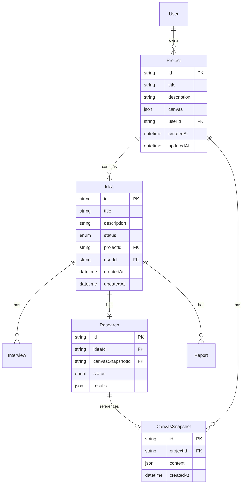

# feat: Project + Canvas Architecture

## Overview

Introduce a **Project** as the top-level entity, replacing the flat "Idea" model. Each Project owns a rich canvas workspace (structured sections, notes, sub-ideas, links) and one Idea that flows through the existing Interview → Research → Report pipeline. Canvas content feeds into the AI pipeline for better-targeted output. A snapshot of the canvas is frozen when research starts so reports reference stable context.

**Scope:** Database schema, server API, shared types, web frontend, mobile frontend, data migration.

## Problem Statement / Motivation

The current "Idea" model is flat — a title and description are the only context the user can provide before entering the pipeline. Users often have research notes, competitor lists, target audience insights, and related sub-ideas that inform their business concept but have nowhere to capture them. This context gap means:

1. The AI interviewer asks questions the user has already answered mentally
2. Research output is less targeted than it could be
3. Users maintain context externally (docs, notes apps) instead of in-product

A Project + Canvas model solves this by giving users a structured workspace to gather context before (and during) the pipeline, and feeding that context into AI generation.

## Proposed Solution

### Architecture

```
User
  └── Project
        ├── title, description?, canvas (JSON blocks), userId, status (derived)
        ├── CanvasSnapshot (frozen canvas JSON, created per research run)
        └── Idea (existing model + projectId FK)
              ├── Interview
              ├── Research (gains canvasSnapshotId FK)
              └── Report
```

**Key design decisions (from brainstorm + gap analysis):**

| Decision | Choice | Rationale |
|----------|--------|-----------|
| Canvas data model | JSON block array on Project | Matches existing `BlogPost.content` pattern. Avoids complex relational model. Queryable via JSONB. |
| Canvas sections | Mix of predefined + custom | Predefined types give AI semantic meaning; custom sections give flexibility |
| File attachments | **Deferred to Phase 2** | No upload infra exists. Canvas v1 = text sections, notes, sub-ideas, URL links only |
| Save behavior | Auto-save with debounce | Prevents data loss; single-user so no conflict resolution needed |
| Canvas lifecycle | Always editable, snapshot on research start | Brainstorm decision. Snapshot stores frozen canvas JSON. |
| Re-run research | Creates new snapshot | Research gains `canvasSnapshotId` FK. Old snapshots retained. |
| Project without idea | Allowed (status = DRAFT) | Users can build canvas before committing to an idea |
| Idea deletion | Allowed, project reverts to DRAFT | Project persists; canvas content is preserved |
| AI context | Canvas feeds into research + reports, NOT interview | Interview already discovers context through dialogue; canvas complements, not replaces |
| Canvas serialization for AI | Markdown sections | `## Target Audience\n{content}\n\n## Competitors\n{content}` |
| Mobile canvas | Read-only list view at launch | Full editing is web-only |
| URL structure | `/projects/[id]` + `/projects/[id]/idea/...` | Single idea at launch; nested ideas later |
| Old URL redirects | Next.js middleware redirect `/ideas/*` → `/projects/*` | Preserves bookmarks and shared links |
| Ownership | `userId` on Project only; Idea inherits via project | Avoids redundant ownership checks |
| One-idea enforcement | Frontend only (schema is one-to-many) | `projectId` on Idea without `@unique` — ready for multi-idea |

### URL Structure

```
/projects                         → Project list (replaces /ideas)
/projects/[id]                    → Canvas view (default)
/projects/[id]/idea               → Idea detail / status overview
/projects/[id]/idea/interview     → Interview chat
/projects/[id]/idea/market-analysis  → Research sub-pages
/projects/[id]/idea/competitors
/projects/[id]/idea/reports/business-plan
```

### ERD



---

## Technical Approach

### Implementation Phases

#### Phase 1: Schema + Server Foundation
**Goal:** New models, migration, project router, shared types.

##### 1.1 Prisma Schema Changes

**File:** `packages/server/prisma/schema.prisma`

Add `Project` model (follows existing conventions: cuid ID, timestamps, cascade deletes, indexed FKs):

```prisma
// ============ PROJECT ============

model Project {
  id          String   @id @default(cuid())
  title       String
  description String?  @db.Text
  canvas      Json     @default("[]")  // Array of CanvasBlock objects
  userId      String
  createdAt   DateTime @default(now())
  updatedAt   DateTime @updatedAt

  user      User              @relation(fields: [userId], references: [id], onDelete: Cascade)
  ideas     Idea[]
  snapshots CanvasSnapshot[]

  @@index([userId])
}

model CanvasSnapshot {
  id        String   @id @default(cuid())
  projectId String
  content   Json     // Frozen canvas blocks at time of snapshot
  createdAt DateTime @default(now())

  project   Project    @relation(fields: [projectId], references: [id], onDelete: Cascade)
  research  Research[]

  @@index([projectId])
}
```

Modify `Idea` model — add `projectId` FK:

```prisma
model Idea {
  // ... existing fields ...
  projectId String?   // Nullable during migration, required after

  project   Project?  @relation(fields: [projectId], references: [id], onDelete: Cascade)
  // ... existing relations ...

  @@index([projectId])
}
```

Modify `Research` model — add `canvasSnapshotId` FK:

```prisma
model Research {
  // ... existing fields ...
  canvasSnapshotId String?

  canvasSnapshot CanvasSnapshot? @relation(fields: [canvasSnapshotId], references: [id])
  // ... existing relations ...

  @@index([canvasSnapshotId])
}
```

Add `Project` relation to `User`:

```prisma
model User {
  // ... existing fields ...
  projects Project[]
}
```

##### 1.2 Canvas Block Type Definition

**File:** `packages/shared/src/types/index.ts`

```typescript
// Canvas block types
export type CanvasBlockType = 'section' | 'note' | 'subIdea' | 'link';

export interface CanvasBlockBase {
  id: string;          // Client-generated cuid
  type: CanvasBlockType;
  order: number;
  createdAt: string;   // ISO date
  updatedAt: string;
}

export interface CanvasSectionBlock extends CanvasBlockBase {
  type: 'section';
  sectionType: PredefinedSectionType | 'custom';
  title: string;
  content: string;     // Rich text / markdown
}

export interface CanvasNoteBlock extends CanvasBlockBase {
  type: 'note';
  content: string;
}

export interface CanvasSubIdeaBlock extends CanvasBlockBase {
  type: 'subIdea';
  title: string;
  description: string;
}

export interface CanvasLinkBlock extends CanvasBlockBase {
  type: 'link';
  url: string;
  title?: string;       // User-provided or auto-fetched later
  description?: string;
}

export type CanvasBlock =
  | CanvasSectionBlock
  | CanvasNoteBlock
  | CanvasSubIdeaBlock
  | CanvasLinkBlock;

export type PredefinedSectionType =
  | 'target_audience'
  | 'problem_statement'
  | 'competitors'
  | 'inspiration'
  | 'open_questions'
  | 'revenue_model';
```

##### 1.3 Shared Validators

**File:** `packages/shared/src/validators/index.ts`

```typescript
// Project schemas
export const createProjectSchema = z.object({
  title: z.string().min(1, 'Title is required').max(200, 'Title too long'),
  description: z.string().max(5000).optional(),
});
export type CreateProjectInput = z.infer<typeof createProjectSchema>;

export const updateProjectSchema = z.object({
  title: z.string().min(1).max(200).optional(),
  description: z.string().max(5000).nullable().optional(),
});
export type UpdateProjectInput = z.infer<typeof updateProjectSchema>;

// Canvas block schemas
export const canvasBlockSchema = z.discriminatedUnion('type', [
  z.object({
    id: z.string(),
    type: z.literal('section'),
    order: z.number(),
    sectionType: z.string(),
    title: z.string().max(200),
    content: z.string().max(10000),
    createdAt: z.string(),
    updatedAt: z.string(),
  }),
  z.object({
    id: z.string(),
    type: z.literal('note'),
    order: z.number(),
    content: z.string().max(5000),
    createdAt: z.string(),
    updatedAt: z.string(),
  }),
  z.object({
    id: z.string(),
    type: z.literal('subIdea'),
    order: z.number(),
    title: z.string().max(200),
    description: z.string().max(2000),
    createdAt: z.string(),
    updatedAt: z.string(),
  }),
  z.object({
    id: z.string(),
    type: z.literal('link'),
    order: z.number(),
    url: z.string().url(),
    title: z.string().max(200).optional(),
    description: z.string().max(500).optional(),
    createdAt: z.string(),
    updatedAt: z.string(),
  }),
]);

export const updateCanvasSchema = z.object({
  blocks: z.array(canvasBlockSchema),
});
export type UpdateCanvasInput = z.infer<typeof updateCanvasSchema>;
```

##### 1.4 Shared Constants

**File:** `packages/shared/src/constants/index.ts`

```typescript
export const PROJECT_STATUS_LABELS: Record<string, string> = {
  DRAFT: 'Draft',
  ACTIVE: 'Active',
  COMPLETE: 'Complete',
};

export const PREDEFINED_SECTIONS = [
  { type: 'target_audience', title: 'Target Audience', description: 'Who is this for?' },
  { type: 'problem_statement', title: 'Problem Statement', description: 'What problem does this solve?' },
  { type: 'competitors', title: 'Competitors', description: 'Who else is solving this?' },
  { type: 'inspiration', title: 'Inspiration', description: 'What inspired this idea?' },
  { type: 'open_questions', title: 'Open Questions', description: 'What do you still need to figure out?' },
  { type: 'revenue_model', title: 'Revenue Model', description: 'How will this make money?' },
] as const;
```

##### 1.5 Project tRPC Router

**File:** `packages/server/src/routers/project.ts` (NEW)

Endpoints (following `ideaRouter` patterns):

| Procedure | Type | Input | Description |
|-----------|------|-------|-------------|
| `list` | query | pagination? | List user's projects with idea count + derived status |
| `get` | query | `{ id }` | Get project with canvas, ideas, snapshots |
| `create` | mutation | `createProjectSchema` | Create project with empty canvas |
| `update` | mutation | `{ id, data: updateProjectSchema }` | Update title/description |
| `updateCanvas` | mutation | `{ id, blocks: CanvasBlock[] }` | Replace canvas blocks (auto-save target) |
| `delete` | mutation | `{ id }` | Delete project + cascade ideas/snapshots |

Register in `packages/server/src/routers/index.ts`:
```typescript
project: projectRouter,
```

##### 1.6 Canvas Snapshot Utility

**File:** `packages/server/src/lib/canvas-snapshot.ts` (NEW)

```typescript
export async function createCanvasSnapshot(
  prisma: PrismaClient,
  projectId: string,
): Promise<string> {
  const project = await prisma.project.findUniqueOrThrow({
    where: { id: projectId },
    select: { canvas: true },
  });

  const snapshot = await prisma.canvasSnapshot.create({
    data: {
      projectId,
      content: project.canvas,
    },
  });

  return snapshot.id;
}
```

Called from all research entry points:
- `interview.ts` → on complete (when auto-starting research)
- `idea.ts` → `startResearch` mutation
- `research.ts` → `start` and `startSpark` mutations

##### 1.7 Canvas Serialization for AI

**File:** `packages/shared/src/utils/canvas-serializer.ts` (NEW)

```typescript
export function serializeCanvasForAI(blocks: CanvasBlock[]): string {
  // Produces markdown like:
  // ## Target Audience
  // {section content}
  //
  // ## Note
  // {note content}
  //
  // ## Sub-Idea: {title}
  // {description}
  //
  // ## Reference Link
  // {url} - {title}
}
```

Injected into `ResearchInput` in `research-ai.ts` and `spark-ai.ts` as an additional `canvasContext: string` field alongside `ideaTitle` and `ideaDescription`.

##### 1.8 Modify Idea Router

**File:** `packages/server/src/routers/idea.ts`

- `create` mutation: require `projectId` input. Validate project ownership. Enforce one-idea-per-project in application logic.
- `startInterview` / `startResearch`: look up the idea's project, create canvas snapshot.
- `delete`: after deletion, project reverts to DRAFT-like state (no idea).
- Remove `list` from idea router (projects are now listed instead). Keep `get` for direct idea access.

##### 1.9 Data Migration Script

**File:** `packages/server/prisma/migrations/migrate-ideas-to-projects.ts` (NEW)

```typescript
// For each existing Idea:
// 1. Create a Project with title = idea.title, canvas = [], userId = idea.userId
// 2. Set idea.projectId = project.id
// 3. After migration, make projectId non-nullable
```

Run via `pnpm db:push` first (add nullable projectId), then run migration script, then make projectId required and push again.

---

#### Phase 2: Web Frontend — Routes + Canvas UI
**Goal:** New URL structure, project list, canvas editor, updated navigation.

##### 2.1 Route Migration

Rename directory: `(dashboard)/ideas/` → `(dashboard)/projects/`

New structure:
```
(dashboard)/
  projects/
    page.tsx                          → Project list
    [id]/
      layout.tsx                      → Project layout (server → client delegation)
      page.tsx                        → Canvas view (default)
      components/
        project-layout-client.tsx     → Client layout with data fetching
        project-secondary-nav.tsx     → Updated nav with Canvas tab
        canvas-editor.tsx             → Canvas block editor (NEW)
        canvas-block-section.tsx      → Section block component
        canvas-block-note.tsx         → Note block component
        canvas-block-subidea.tsx      → Sub-idea block component
        canvas-block-link.tsx         → Link block component
        canvas-add-block.tsx          → "Add block" menu
        canvas-snapshot-banner.tsx    → "Research using snapshot from [date]" indicator
      idea/
        page.tsx                      → Idea detail / status overview
        interview/
          page.tsx                    → Interview chat
        market-analysis/
          page.tsx
        competitors/
          page.tsx
        ... (existing research sub-pages)
        reports/
          business-plan/
            page.tsx
```

##### 2.2 URL Redirect Middleware

**File:** `packages/web/src/middleware.ts` (MODIFY)

Add redirect rule:
```typescript
// Redirect /ideas/[id]/* to /projects/[projectId]/*
// Requires a lookup: idea.id → idea.projectId
// For simplicity, redirect /ideas/* to /projects with a flash message
// Or: server-side redirect that looks up the project by idea ID
```

##### 2.3 Canvas Editor Component

**File:** `packages/web/src/app/(dashboard)/projects/[id]/components/canvas-editor.tsx` (NEW)

- Renders canvas blocks in order
- Each block type has its own component (section, note, subIdea, link)
- "Add block" button/menu at the bottom (or between blocks)
- Drag-and-drop reordering via block `order` field
- Auto-save via debounced `trpc.project.updateCanvas.useMutation()`
- Blocks are editable inline (click to edit, blur to save)

##### 2.4 Sidebar Updates

**File:** `packages/web/src/components/layout/sidebar.tsx` (MODIFY)

- "Vault" link → `/projects` instead of `/ideas`
- Mini cards show projects instead of ideas
- Rename `IdeaMiniCard` → `ProjectMiniCard`

**File:** `packages/web/src/components/layout/idea-mini-card.tsx` → rename to `project-mini-card.tsx`

- Show project title + derived status (DRAFT/ACTIVE/COMPLETE)
- Link to `/projects/[id]`

##### 2.5 Project Secondary Nav

**File:** `packages/web/src/app/(dashboard)/projects/[id]/components/project-secondary-nav.tsx` (NEW)

Structure:
```
Canvas (default, top)
─────────────────
Idea
  Overview
  Market Analysis
  Competitors
  ...
  Reports
    Business Plan
    ...
```

Canvas tab is always visible. Idea sub-nav only visible when an idea exists.

##### 2.6 Project List Page

**File:** `packages/web/src/app/(dashboard)/projects/page.tsx` (NEW)

- Replace the current ideas list
- Show project cards with title, derived status, idea count, last updated
- "New Project" button → create project → navigate to canvas

##### 2.7 Project Status Utility

**File:** `packages/web/src/lib/project-status.ts` (NEW, replaces `idea-status.ts`)

```typescript
export function deriveProjectStatus(project: {
  ideas: { status: IdeaStatus }[];
}): 'DRAFT' | 'ACTIVE' | 'COMPLETE' {
  if (project.ideas.length === 0) return 'DRAFT';
  const idea = project.ideas[0];
  if (idea.status === 'COMPLETE') return 'COMPLETE';
  return 'ACTIVE';
}
```

---

#### Phase 3: Mobile Frontend
**Goal:** Updated routes, read-only canvas view, project list.

##### 3.1 Route Migration

Rename: `(tabs)/ideas/` → `(tabs)/projects/`

```
(tabs)/
  projects/
    _layout.tsx
    index.tsx              → Project list
    new.tsx                → Create project
    [id]/
      index.tsx            → Project detail (canvas read-only + idea status)
      canvas.tsx           → Read-only canvas view (collapsible sections)
      idea/
        index.tsx          → Idea detail
        interview.tsx      → Interview chat
```

##### 3.2 Read-Only Canvas View

- Collapsible section list (one section per `CanvasBlock`)
- No inline editing — show "Edit on web" prompt
- Sub-ideas and links are tappable/expandable

---

#### Phase 4: AI Pipeline Integration
**Goal:** Canvas context flows into research and report generation.

##### 4.1 Research AI Changes

**File:** `packages/server/src/services/research-ai.ts` (MODIFY)

- Add `canvasContext?: string` to `ResearchInput` interface
- In `synthesizeInsights()` and `extractInsights()`, append canvas context to the system prompt
- Load canvas from the `CanvasSnapshot` (not live canvas) via `research.canvasSnapshotId`

##### 4.2 Spark AI Changes

**File:** `packages/server/src/services/spark-ai.ts` (MODIFY)

- Same pattern: add canvas context to the prompts that generate analysis
- Load from snapshot

##### 4.3 Snapshot Creation in Pipeline Entry Points

**Files to modify:**
- `packages/server/src/routers/interview.ts` → in `complete` mutation, after creating Research, create snapshot and link
- `packages/server/src/routers/idea.ts` → in `startResearch`, create snapshot
- `packages/server/src/routers/research.ts` → in `start` / `startSpark`, create snapshot

All use the shared `createCanvasSnapshot()` utility from Phase 1.6.

---

#### Phase 5: Polish + Cleanup
**Goal:** Remove dead code, verify migration, test.

##### 5.1 Remove Old Routes
- Delete `(dashboard)/ideas/` directory (after verifying redirect works)
- Delete `(tabs)/ideas/` directory on mobile
- Remove `idea-status.ts`, `idea-mini-card.tsx` (replaced by project equivalents)

##### 5.2 Update CLAUDE.md
- Update Architecture section with Project model
- Update router table
- Update key files section
- Add to Change Log

##### 5.3 Audit Logging
- Add `PROJECT_CREATE`, `PROJECT_UPDATE`, `PROJECT_DELETE`, `CANVAS_UPDATE`, `CANVAS_SNAPSHOT` actions
- Update resource format: `project:abc123`

##### 5.4 Type Check + Testing
- `pnpm type-check` from BETA root
- Manual test: create project → build canvas → add idea → run interview → verify snapshot → check research results reference canvas content
- Verify `/ideas/[id]` redirect works
- Verify mobile read-only canvas

---

## Acceptance Criteria

### Functional Requirements

- [ ] User can create a Project with a title
- [ ] User can view and edit a canvas with sections, notes, sub-ideas, and links
- [ ] User can add predefined sections (Target Audience, Competitors, etc.) or custom sections
- [ ] User can reorder canvas blocks
- [ ] Canvas auto-saves on edit
- [ ] User can create one Idea within a Project
- [x] Starting research creates a frozen CanvasSnapshot
- [x] Research and reports reference the snapshot, not the live canvas
- [ ] Re-running research creates a new snapshot
- [ ] AI-generated research includes canvas context in its analysis
- [ ] User can delete an idea; project reverts to Draft state
- [ ] Project can exist without an idea (Draft state)
- [ ] Sidebar shows projects instead of ideas
- [ ] All URLs use `/projects/[id]` pattern
- [ ] Old `/ideas/*` URLs redirect to corresponding `/projects/*` URLs
- [ ] Existing ideas are migrated to projects automatically
- [ ] Mobile app shows read-only canvas view

### Non-Functional Requirements

- [ ] Canvas auto-save debounced to max 1 request per 2 seconds
- [ ] Canvas JSON size < 1MB per project (soft limit, warn user)
- [ ] Snapshot creation is atomic (transaction with research creation)
- [x] Type-check passes across all packages (`pnpm type-check`)

### Quality Gates

- [ ] All existing functionality preserved (interview, research, reports work identically)
- [ ] No broken links from old `/ideas/*` URLs
- [ ] Mobile app compiles and navigates correctly
- [x] Canvas serialization for AI produces clean, readable markdown

---

## Dependencies & Prerequisites

1. **No new infrastructure needed for Phase 1** — canvas is JSON on Project model, no file storage
2. Prisma schema push + client regeneration (`pnpm db:push && pnpm db:generate`)
3. Migration script for existing data (ideas → projects)
4. File upload infrastructure deferred to future Phase 2

---

## Risk Analysis & Mitigation

| Risk | Likelihood | Impact | Mitigation |
|------|-----------|--------|------------|
| Migration corrupts existing data | Low | High | Run migration in transaction; test on staging first; keep `projectId` nullable initially |
| Canvas JSON grows too large | Medium | Medium | Add client-side size check; warn at 500KB; hard limit at 1MB |
| Auto-save race condition with snapshot | Low | Medium | Snapshot creation uses DB transaction that reads canvas atomically |
| Old URL bookmarks break | Medium | Low | Redirect middleware handles all `/ideas/*` → `/projects/*` |
| Mobile canvas editing demand | Medium | Low | Ship read-only first; add editing based on user feedback |
| AI prompt token overflow with large canvas | Medium | Medium | Truncate canvas serialization to 4000 chars in AI context; prioritize sections over notes |

---

## Future Considerations

- **Multiple ideas per project:** Schema is ready (no `@unique` on `projectId`). Frontend enforces one idea; remove that constraint when ready.
- **File/image attachments:** Add `CanvasFileBlock` type + Supabase Storage integration in a future phase.
- **Canvas templates:** Predefined canvas layouts (e.g., "SaaS Startup", "E-commerce", "Content Business").
- **Shared projects:** Add `ProjectMember` model for team collaboration.
- **Canvas versioning:** Track edit history beyond snapshots.
- **Link enrichment:** Auto-fetch title/favicon/preview for URL blocks.

---

## References & Research

### Internal References
- Brainstorm: [docs/brainstorms/2026-02-06-project-canvas-brainstorm.md](docs/brainstorms/2026-02-06-project-canvas-brainstorm.md)
- Prisma schema: [packages/server/prisma/schema.prisma](packages/server/prisma/schema.prisma)
- Idea router pattern: [packages/server/src/routers/idea.ts](packages/server/src/routers/idea.ts)
- Shared types: [packages/shared/src/types/index.ts](packages/shared/src/types/index.ts)
- Shared validators: [packages/shared/src/validators/index.ts](packages/shared/src/validators/index.ts)
- Web ideas routes: [packages/web/src/app/(dashboard)/ideas/](packages/web/src/app/(dashboard)/ideas/)
- Mobile ideas routes: [packages/mobile/src/app/(tabs)/ideas/](packages/mobile/src/app/(tabs)/ideas/)
- Blog TipTap pattern: [packages/web/src/components/blog/PostForm.tsx](packages/web/src/components/blog/PostForm.tsx)
- Frontend design guidelines: [skills/frontend-design/frontend-design.md](skills/frontend-design/frontend-design.md)

### Codebase Impact
- ~162 `ideaId` references across 34 files (most unchanged; some gain `projectId` sibling)
- ~50 web route files (directory rename)
- ~5 mobile route files (directory rename)
- 6 shared type/validator/constant files (additions)
- 5 server router files (modifications)
- 3 AI service files (canvas context injection)

### Post-Change Checklist (from CLAUDE.md)
- [x] `pnpm db:push` after schema changes
- [x] `pnpm db:generate` after schema changes
- [x] `pnpm type-check` from BETA root
- [ ] Verify no "invalid input value for enum" errors
- [ ] Test with authenticated requests on web and mobile
