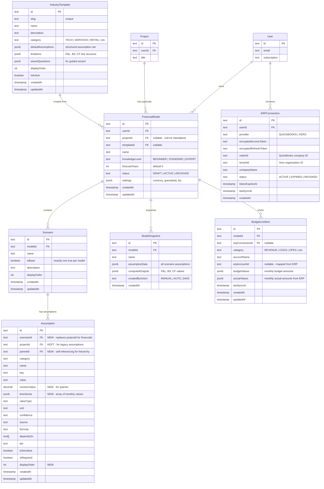

## Enhancement Summary

**Deepened on:** 2026-02-24
**Research agents used:** 10 (Architecture Strategist, Security Sentinel, Performance Oracle, Data Integrity Guardian, Kieran TypeScript Reviewer, Code Simplicity Reviewer, Frontend Design Reviewer, Pattern Recognition Specialist, 3-Statement Model Best Practices Researcher, Financial Function Edge Cases Researcher)
**Context7 docs queried:** ExcelJS, pptxgenjs, math.js
**Critical bugs found:** 1 (encryption decrypt function)
**Total findings:** 90+ across all agents

### Critical Issues (Must Fix Before Implementation)

1. **Encryption `decrypt()` bug** — IV used as key parameter in `createDecipheriv`. Confirmed by 5 of 10 agents independently. Silent data corruption of all ERP tokens. One-line fix but blocking.
2. **OAuth CSRF vulnerability** — No `state` parameter or PKCE in QuickBooks/Xero OAuth flows. Account linking can be hijacked.
3. **Formula engine sandbox escape** — Expert-mode custom formulas need AST whitelist enforcement. Current `math.js` disabled functions list is insufficient for user-authored formulas.
4. **Excel formula injection** — Exported cell values starting with `=`, `+`, `-`, `@` can execute formulas in recipient's Excel. Must sanitize all text cells.

### Key Architectural Improvements Discovered

1. **Separate `FinancialAssumption` table** instead of overloading existing `Assumption` table with dual FKs (architecture + data integrity agents agree)
2. **Prior-period debt balance** for interest calculations eliminates all circular references with negligible accuracy loss
3. **Dirty-flag cascade optimization** — only recalculate downstream subgraph on single-value changes (P0 for performance)
4. **Vectorized time-series evaluation** — evaluate 60 months in one engine call, not 60 separate calls
5. **Templates as static TypeScript files** — drop `IndustryTemplate` database table entirely
6. **Distributed lock for ERP token refresh** — prevents race condition that revokes QuickBooks/Xero connections

### Scope Reduction Opportunities (35-45% LOC savings)

1. **Start with 4 templates** (SaaS, Services, E-commerce, General) instead of 12+ — remaining are content, not code
2. **Replace 3 knowledge modes with progressive disclosure** — eliminates combinatorial content problem
3. **Defer ERP integration (Phase 4)** — architecturally independent, $300/mo QuickBooks cost, 4-6 weeks saved
4. **Run exports synchronously** — typical generation is 5-10 seconds, skip BullMQ queues for MVP
5. **Defer sensitivity analysis** — scenarios + break-even cover the analysis need
6. **Defer PowerPoint export** — PDF covers presentation need for MVP

### New Considerations Discovered

- **3-statement linking order**: P&L first → Balance Sheet working capital → Cash Flow → close with ending cash back to BS
- **Sign convention**: Keep calculations positive internally, switch signs only for display output
- **Aggregation rules**: Never average ratios across periods — recompute from aggregated numerators/denominators
- **SaaS-specific line items**: Deferred revenue is "possibly the most important line item on a SaaS balance sheet" (SaaS Capital)
- **IRR algorithm**: Newton-Raphson primary + Brent's method fallback; never rely on Newton alone
- **Excel DB() function**: Excel rounds the depreciation rate to 3 decimal places — must replicate
- **Financial number formatting**: Use `font-variant-numeric: tabular-nums lining-nums` for all numeric cells
- **React Query caching**: Use invalidation-based (`staleTime: Infinity` + explicit invalidation on mutation) instead of time-based staleTime
- **Snapshot sizing**: ~1MB per snapshot; implement retention limits and delta-based auto-saves

---

# Financial Modeling & Forecasting Tool

## Overview

Add a financial modeling and forecasting module to IdeationLab that produces 3-statement financial models (P&L, Balance Sheet, Cash Flow), budgeting with QuickBooks/Xero read-only import, scenario analysis, and investor-ready exports. Serves two entry points: (1) add-on to the existing idea evaluation pipeline that auto-seeds assumptions from research data, and (2) standalone tool with industry templates and a guided wizard.

Architecture: **Calculation Engine + AI Narratives (A+C Hybrid)** — deterministic server-side engine for all math, AI for narratives/explanations/assumption seeding, spreadsheet-in-browser deferred to Phase 2.

Built as a new module within the existing forge-automation monorepo, sharing auth, database, tRPC patterns, and AI infrastructure.

## Problem Statement

Users who complete the idea evaluation pipeline have rich research data (TAM/SAM/SOM, CAC, unit economics, pricing) but no way to translate it into financial projections for investors or lenders. Existing business owners need budgeting and forecasting tools that integrate with their accounting software. Both audiences need financial models they can trust, export, and present — but have varying levels of financial literacy.

## Proposed Solution

A calculation engine that extends the existing formula/cascade/confidence engines from the `feat/assumptions-and-financials` branch, combined with AI-generated narratives for presentations. Three knowledge modes (Beginner, Standard, Expert) adapt the UI complexity. Industry templates (12+) provide pre-filled assumptions. Excel export writes real formulas. PDF and PowerPoint exports include AI-generated investor narratives.

## Technical Approach

### Architecture

```
┌─────────────────────────────────────────────────────────────────────┐
│                        Frontend (Next.js 15)                        │
│  ┌──────────────┐ ┌──────────────┐ ┌──────────────┐ ┌───────────┐  │
│  │  Model Setup  │ │  Assumptions │ │  Statements  │ │  Exports  │  │
│  │  (Template/   │ │  Editor (3   │ │  Dashboard   │ │  (Excel,  │  │
│  │   Wizard)     │ │  modes)      │ │  (P&L,BS,CF) │ │  PDF,PPTX)│  │
│  └──────┬───────┘ └──────┬───────┘ └──────┬───────┘ └─────┬─────┘  │
│         │                │                │               │         │
│  ┌──────┴────────────────┴────────────────┴───────────────┴─────┐  │
│  │                    tRPC React Query Client                    │  │
│  └───────────────────────────┬───────────────────────────────────┘  │
└──────────────────────────────┼──────────────────────────────────────┘
                               │
┌──────────────────────────────┼──────────────────────────────────────┐
│                        Server (tRPC)                                │
│  ┌──────────────┐ ┌─────────┴──────────┐ ┌──────────────────────┐  │
│  │  financial    │ │  scenario router   │ │  export router       │  │
│  │  router       │ │                    │ │                      │  │
│  └──────┬───────┘ └────────┬───────────┘ └──────────┬───────────┘  │
│         │                  │                        │               │
│  ┌──────┴──────────────────┴────────────────────────┴───────────┐  │
│  │                    Calculation Engine                          │  │
│  │  ┌────────────┐ ┌────────────┐ ┌────────────┐ ┌───────────┐  │  │
│  │  │  Formula    │ │  Cascade   │ │ Confidence │ │ Financial │  │  │
│  │  │  Engine     │ │  Engine    │ │  Engine    │ │ Functions │  │  │
│  │  │  (extended) │ │  (extended)│ │ (extended) │ │  (new)    │  │  │
│  │  └────────────┘ └────────────┘ └────────────┘ └───────────┘  │  │
│  └──────────────────────────────────────────────────────────────┘  │
│                                                                     │
│  ┌──────────────────┐  ┌──────────────┐  ┌──────────────────────┐  │
│  │  Template System  │  │  AI Narrator │  │  ERP Integration     │  │
│  │  (12+ templates)  │  │  (Claude/GPT)│  │  (QuickBooks/Xero)   │  │
│  └──────────────────┘  └──────────────┘  └──────────────────────┘  │
│                                                                     │
│  ┌──────────────────────────────────────────────────────────────┐  │
│  │  BullMQ Workers: Excel Gen | PDF Gen | PPTX Gen | AI Seed   │  │
│  └──────────────────────────────────────────────────────────────┘  │
└─────────────────────────────────────────────────────────────────────┘
                               │
┌──────────────────────────────┼──────────────────────────────────────┐
│                    PostgreSQL (Supabase)                             │
│  FinancialModel | Scenario | Assumption (ext) | ModelSnapshot       │
│  IndustryTemplate | ERPConnection | BudgetLineItem                  │
└─────────────────────────────────────────────────────────────────────┘
```

### Database Schema (ERD)



### Implementation Phases

---

#### Phase 0: Foundation (Engine Hardening)

**Goal:** Add test coverage to existing engines and extend them for financial modeling before building any new features. This is blocking — financial calculations cannot ship without tests.

**Estimated effort:** 2-3 weeks

##### Task 0.1: Test Suite for Existing Engines

Add comprehensive tests for the formula, cascade, and confidence engines. Target >90% coverage on calculation code.

- [x] Create `packages/server/src/lib/__tests__/formula-engine.test.ts` (86 tests, 94.5% line coverage)
  - Arithmetic operations, scope variables, division by zero, NaN handling
  - Security: injection prevention, disabled function rejection
  - Compilation caching: same formula returns cached result
  - Dependency extraction: finds variables, excludes builtins
  - Edge cases: empty formula, whitespace, special characters
  - **Bonus:** Fixed Object.create(null) incompatibility with math.js v14
- [x] Create `packages/server/src/lib/__tests__/cascade-engine.test.ts` (42 tests, 91.5% line coverage)
  - Cycle detection: A→B→A, A→B→C→A
  - Topological sort: correct evaluation order
  - Depth limiting: exceeding MAX_CASCADE_DEPTH
  - Downstream impact: correct nodes identified
  - Transaction safety: rollback on error
  - **Bonus:** Fixed topologicalSortDownstream in-degree calculation bug
- [x] Create `packages/server/src/lib/__tests__/confidence-engine.test.ts` (23 tests, 100% coverage)
  - Hierarchy: USER > RESEARCHED > AI_ESTIMATE > CALCULATED
  - Effective confidence: CALCULATED inherits lowest from inputs
  - Staleness: 30-day RESEARCHED, 7-day AI_ESTIMATE thresholds
  - Recursive confidence through dependency chains

```typescript
// packages/server/src/lib/__tests__/formula-engine.test.ts
describe('evaluateFormula', () => {
  it('evaluates simple arithmetic', () => {
    expect(evaluateFormula('5 + 3', {})).toBe(8);
  });

  it('uses scope variables', () => {
    expect(evaluateFormula('price * quantity', { price: 10, quantity: 5 })).toBe(50);
  });

  it('returns null on division by zero', () => {
    expect(evaluateFormula('1 / 0', {})).toBeNull();
  });

  it('rejects disabled functions', () => {
    expect(evaluateFormula('import("fs")', {})).toBeNull();
  });

  it('handles gross margin formula', () => {
    const scope = { unit_price: 100, variable_cost: 40 };
    expect(evaluateFormula('(unit_price - variable_cost) / unit_price * 100', scope)).toBe(60);
  });
});
```

##### Task 0.2: Increase Cascade Depth Limit

- [x] Change `MAX_CASCADE_DEPTH` from 10 to 50 in `packages/server/src/lib/cascade-engine.ts`
- [x] Add performance benchmark test at 200 assumptions with 50 depth
- [x] Verify sub-100ms cascade execution at scale (~20ms actual)

##### Task 0.3: Financial Functions Module

Create a new module with standard financial functions, tested against Excel benchmark values.

- [x] Create `packages/server/src/lib/financial-functions.ts` (75 tests, 83.9% coverage)
  - `PMT(rate, nper, pv, fv?, type?)` — Payment for a loan
  - `PV(rate, nper, pmt, fv?, type?)` — Present value
  - `FV(rate, nper, pmt, pv?, type?)` — Future value
  - `NPV(rate, cashflows)` — Net present value (array param per RI-3)
  - `IRR(cashflows, guess?)` — Internal rate of return (Newton-Raphson + bisection)
  - `XIRR(cashflows, dates, guess?)` — IRR with dates
  - `NPER(rate, pmt, pv, fv?, type?)` — Number of periods
  - `SLN(cost, salvage, life)` — Straight-line depreciation
  - `DB(cost, salvage, life, period, month?)` — Declining balance depreciation
- [x] Create `packages/server/src/lib/__tests__/financial-functions.test.ts`
  - Test every function against Excel-verified values
  - Edge cases: zero rate, zero payment, negative values, large periods
  - Cross-function consistency tests (PMT/PV/FV/NPER round-trip, NPV at IRR ≈ 0)
- [x] Register financial functions as safe custom functions in the formula engine
  - Registered via math.js safeImport with override:true

```typescript
// packages/server/src/lib/financial-functions.ts
export function PMT(rate: number, nper: number, pv: number, fv = 0, type = 0): number {
  if (rate === 0) return -(pv + fv) / nper;
  const pvif = Math.pow(1 + rate, nper);
  return -(rate * (pv * pvif + fv)) / (pvif - 1) / (1 + rate * type);
}

export function NPV(rate: number, ...cashflows: number[]): number {
  return cashflows.reduce((npv, cf, i) => npv + cf / Math.pow(1 + rate, i + 1), 0);
}

export function IRR(cashflows: number[], guess = 0.1): number | null {
  // Newton-Raphson iterative method
  let rate = guess;
  for (let i = 0; i < 100; i++) {
    let npv = 0, dnpv = 0;
    for (let j = 0; j < cashflows.length; j++) {
      npv += cashflows[j] / Math.pow(1 + rate, j);
      dnpv -= j * cashflows[j] / Math.pow(1 + rate, j + 1);
    }
    const newRate = rate - npv / dnpv;
    if (Math.abs(newRate - rate) < 1e-10) return newRate;
    rate = newRate;
  }
  return null; // did not converge
}
```

##### Task 0.4: Extend Formula Engine for Time-Series and Conditionals

- [x] Extend `evaluateFormula` to accept and return `number[]` via new `evaluateTimeSeriesFormula()` (25 tests)
- [x] Add array functions: `SUM(array)`, `AVERAGE(array)`, `CUMSUM(array)`, `SLICE(array, start, end)`
- [x] Add conditional: `IF(condition, trueVal, falseVal)` — registered as safe math.js function
- [x] Add `GROWTH(baseValue, rate, periods)` — generates growth time-series array
- [x] Update `extractDependencies` to handle new function signatures (TIME_SERIES_FUNCTION_NAMES added to builtins)
- [x] Update scope type from `Record<string, number>` to `Record<string, number | number[]>` via `TimeSeriesScope`

##### Task 0.5: Extend Cascade Engine for Vectorized Updates

- [x] Add `executeBatchCascade(assumptions, updates: {key, value}[])` — batch update multiple assumptions, cascade once (11 tests)
- [x] Add time-series-aware cascade: when a growth rate changes, recalculate all 60 monthly values downstream
- [x] Build reverse dependency map for O(1) dependent lookup via `buildReverseDependencyMap()` (3 tests)
- [x] Add cascade performance metrics via `CascadeMetrics` type (totalAssumptions, downstreamCount, updatedCount, elapsedMs)

**Success criteria:**
- All three engines have >90% test coverage
- Financial functions match Excel to 6 decimal places
- Cascade handles 200+ assumptions in <100ms
- Time-series formulas produce 60-month arrays

---

#### Phase 1: Data Model & Template System

**Goal:** Build the database schema, model template system, and core CRUD operations. No UI yet — everything is API-level.

**Estimated effort:** 2-3 weeks

##### Task 1.1: Database Schema

Add all new tables and extend the Assumption table. Follow existing patterns in `packages/server/src/db/schema.ts`.

- [x] Add new pgEnums:
  - `knowledgeLevelEnum`: `BEGINNER`, `STANDARD`, `EXPERT`
  - `financialModelStatusEnum`: `DRAFT`, `ACTIVE`, `ARCHIVED`
  - `erpProviderEnum`: `QUICKBOOKS`, `XERO`
  - `erpConnectionStatusEnum`: `ACTIVE`, `EXPIRED`, `REVOKED`
  - `snapshotActionEnum`: `MANUAL`, `AUTO_SAVE`
  - `templateCategoryEnum`: `TECH`, `SERVICES`, `RETAIL`, `FOOD`, `CONSTRUCTION`, `HEALTHCARE`, `REAL_ESTATE`, `MANUFACTURING`, `NONPROFIT`, `FREELANCER`
- [x] Add `FinancialModel` table (see ERD above)
- [x] Add `Scenario` table with unique constraint on `(modelId, isBase)` where `isBase = true`
- [x] Extend `Assumption` table:
  - Add `scenarioId` FK (nullable, for financial model assumptions)
  - Add `parentId` FK (self-referencing, for line-item hierarchy)
  - Add `numericValue` DECIMAL(15,2) column
  - Add `timeSeries` JSONB column (for monthly/quarterly/annual arrays)
  - Add `displayOrder` INTEGER column
  - Add index on `(scenarioId, category)`
- [x] Add `ModelSnapshot` table
- [x] Add `IndustryTemplate` table with unique constraint on `slug`
- [x] Add `ERPConnection` table (tokens encrypted — see Task 1.2)
- [x] Add `BudgetLineItem` table
- [x] Add all relations at the bottom of schema.ts
- [x] Run `pnpm db:generate` (migration generated; `db:push` deferred until DB available)

##### Task 1.2: ERP Token Encryption

- [x] Create `packages/server/src/lib/encryption.ts`
  - `encrypt(plaintext: string): string` — AES-256-GCM with server-side key from `ERP_ENCRYPTION_KEY` env var
  - `decrypt(ciphertext: string): string` — FIXED critical bug: plan had IV used as key param
- [x] Add `ERP_ENCRYPTION_KEY` to `.env.example`
- [ ] Use encryption in ERPConnection CRUD operations (deferred to Task 1.5 router)

```typescript
// packages/server/src/lib/encryption.ts
import { createCipheriv, createDecipheriv, randomBytes } from 'crypto';

const ALGORITHM = 'aes-256-gcm';

export function encrypt(text: string): string {
  const key = Buffer.from(process.env.ERP_ENCRYPTION_KEY!, 'hex');
  const iv = randomBytes(16);
  const cipher = createCipheriv(ALGORITHM, key, iv);
  const encrypted = Buffer.concat([cipher.update(text, 'utf8'), cipher.final()]);
  const authTag = cipher.getAuthTag();
  return `${iv.toString('hex')}:${authTag.toString('hex')}:${encrypted.toString('hex')}`;
}

export function decrypt(data: string): string {
  const key = Buffer.from(process.env.ERP_ENCRYPTION_KEY!, 'hex');
  const [ivHex, authTagHex, encryptedHex] = data.split(':');
  const decipher = createDecipheriv(ALGORITHM, Buffer.from(ivHex, 'hex'), Buffer.from(ivHex, 'hex'));
  decipher.setAuthTag(Buffer.from(authTagHex, 'hex'));
  return decipher.update(encryptedHex, 'hex', 'utf8') + decipher.final('utf8');
}
```

##### Task 1.3: Shared Types & Validators

- [x] Add types to `packages/shared/src/types/index.ts`:
  - `FinancialModel`, `Scenario`, `ModelSnapshot`, `IndustryTemplate`, `ERPConnection`, `BudgetLineItem`
  - `TimeSeriesData` — `{ monthly: number[], quarterly: number[], annual: number[] }`
  - `StatementLine` — `{ key, name, formula, parentKey?, children?, timeSeries }`
  - `FinancialStatement` — `{ type: 'PL' | 'BS' | 'CF', lines: StatementLine[] }`
  - `KnowledgeLevel`, `FinancialModelStatus`, `ERPProvider`
  - Also added: `StatementData`, `ComputedStatements`, `TemplateDefinition`, `TemplateAssumption`, `TemplateLineItem`
- [x] Add Zod validators to `packages/shared/src/validators/index.ts`:
  - `createFinancialModelSchema`, `updateFinancialModelSchema`
  - `createScenarioSchema`, `updateScenarioSchema`
  - `createSnapshotSchema`
  - `erpConnectSchema`, `erpSyncSchema`

##### Task 1.4: Industry Template Catalog

Create 12+ industry templates as structured data. Each template defines default assumptions, P&L/BS/CF line-item structures, and wizard questions.

- [x] Create `packages/server/src/services/financial-templates/` directory
- [x] Create `packages/server/src/services/financial-templates/index.ts` — template registry
- [x] Create MVP template files (4 of 13 — remaining are content, not code):
  - `saas.ts` — SaaS/Software (beginner/standard/expert assumption sets)
  - `ecommerce.ts` — E-commerce (COGS, shipping, inventory, marketplace fees)
  - `professional-services.ts` — Professional Services (billable hours, utilization)
  - `general.ts` — General/Custom (minimal defaults, works for any business)
  - _Deferred:_ ai-agent, restaurant, retail, construction, healthcare, real-estate, manufacturing, nonprofit, freelancer

Each template exports:

```typescript
// packages/server/src/services/financial-templates/saas.ts
export const saasTemplate: TemplateDefinition = {
  slug: 'saas',
  name: 'SaaS / Software',
  description: 'Subscription software with MRR, churn, CAC/LTV metrics',
  category: 'TECH',
  assumptions: {
    beginner: [
      { key: 'monthly_revenue', name: 'Monthly Revenue', valueType: 'CURRENCY', default: 10000 },
      { key: 'revenue_growth_rate', name: 'Monthly Growth Rate', valueType: 'PERCENTAGE', default: 10 },
      { key: 'gross_margin', name: 'Gross Margin', valueType: 'PERCENTAGE', default: 80 },
      { key: 'headcount', name: 'Team Size', valueType: 'NUMBER', default: 3 },
      { key: 'avg_salary', name: 'Average Annual Salary', valueType: 'CURRENCY', default: 80000 },
      { key: 'monthly_opex', name: 'Monthly Operating Expenses', valueType: 'CURRENCY', default: 5000 },
      { key: 'starting_cash', name: 'Starting Cash', valueType: 'CURRENCY', default: 50000 },
      { key: 'monthly_churn', name: 'Monthly Churn Rate', valueType: 'PERCENTAGE', default: 5 },
      { key: 'cac', name: 'Customer Acquisition Cost', valueType: 'CURRENCY', default: 200 },
      { key: 'tax_rate', name: 'Tax Rate', valueType: 'PERCENTAGE', default: 25 },
    ],
    standard: [/* ~25-40 assumptions */],
    expert: [/* 75+ assumptions with all line items */],
  },
  lineItems: {
    pl: [
      { key: 'revenue', name: 'Revenue', children: ['subscription_revenue', 'services_revenue'] },
      { key: 'subscription_revenue', name: 'Subscription Revenue', formula: 'monthly_revenue * GROWTH(1, revenue_growth_rate/100, 60)' },
      { key: 'cogs', name: 'Cost of Goods Sold', formula: 'revenue * (1 - gross_margin/100)' },
      // ...
    ],
    bs: [/* Balance Sheet line items */],
    cf: [/* Cash Flow line items */],
  },
  wizardQuestions: [/* 15-25 guided questions */],
};
```

##### Task 1.5: Core tRPC Routers

- [x] Create `packages/server/src/routers/financial.ts` — Financial Model CRUD
  - `create(templateSlug?, projectId?)` — Create from template or blank
  - `get(modelId)` — Get model with scenarios and active assumption count
  - `list()` — List user's models with pagination
  - `update(modelId, name?, knowledgeLevel?, settings?)` — Update model settings
  - `delete(modelId)` — Soft-delete (set status to ARCHIVED)
  - `listTemplates()` — List available industry templates
  - _Deferred:_ `seedFromResearch` (Phase 2 when UI connects)
- [x] Create `packages/server/src/routers/scenario.ts` — Scenario CRUD
  - `create(modelId, name, cloneFromScenarioId?)` — Create + clone assumptions
  - `list(modelId)` — List scenarios for a model
  - `update(scenarioId, name?)` — Rename
  - `delete(scenarioId)` — Delete (blocks base scenario)
  - `compare(scenarioIds[])` — Return assumption deltas
- [x] Create `packages/server/src/routers/snapshot.ts` — Snapshot CRUD
  - `create(modelId, name)` — Create named snapshot
  - `list(modelId)` — List snapshots
  - `compare(snapshotId1, snapshotId2)` — Diff two snapshots
  - `restore(snapshotId)` — Restore with auto-save of current state
- [x] Extend `packages/server/src/routers/assumption.ts`
  - Added `listByScenario(scenarioId)` — List assumptions by scenario
  - Added `updateByScenario(scenarioId, assumptionId, value?, confidence?)` — Update with cascade
  - _Deferred:_ `bulkImport`, `delete` endpoints
- [x] Register all new routers in `packages/server/src/routers/index.ts`

##### Task 1.6: Model Calculation Service

The core service that takes a scenario's assumptions and produces computed financial statements.

- [x] Create `packages/server/src/services/financial-calculator.ts`
  - `calculateStatements(scenario, assumptions, forecastYears)` → `{ pl: StatementData, bs: StatementData, cf: StatementData }`
  - Builds the full 3-statement model:
    - Year 1: 12 monthly periods
    - Year 2: 4 quarterly periods
    - Years 3-5: 3 annual periods
  - Links between statements:
    - Net Income from P&L flows to Cash Flow and Balance Sheet (retained earnings)
    - Depreciation from P&L added back in Cash Flow
    - Changes in working capital (BS) reflected in Cash Flow
  - Uses formula engine with financial functions for all calculations
  - Cascade engine ensures deterministic evaluation order
- [x] Create `packages/server/src/services/break-even-calculator.ts`
  - Adapts break-even formula based on revenue model:
    - Unit-based: `breakeven_units = fixed_costs / (price - variable_cost)`
    - Subscription: `breakeven_subscribers = fixed_costs / ARPU`
    - Services: `breakeven_hours = fixed_costs / (hourly_rate - variable_cost_per_hour)`
  - Returns break-even point, timeline, and sensitivity data
- [x] ~~Create `packages/server/src/services/sensitivity-analyzer.ts`~~ (Deferred — per scope reduction #5)
  - One-variable tornado: vary one assumption ±20%, measure impact on key metrics
  - Two-variable data table: vary two assumptions, show matrix of outcomes
  - Returns structured data for chart rendering

**Success criteria:**
- All tables created and migrated
- 12+ industry templates with Beginner/Standard/Expert assumption sets
- CRUD operations for models, scenarios, snapshots, and assumptions
- 3-statement calculation produces correct linked output
- All tests pass, `pnpm type-check` passes

---

#### Phase 2: Core UI — Model Creation & Assumptions Editor

**Goal:** Build the user-facing pages for creating financial models and editing assumptions across all three knowledge modes.

**Estimated effort:** 3-4 weeks

##### Task 2.1: Financial Model Creation Page

Two entry points that converge to the same assumptions editor.

- [x] Create `packages/web/src/app/(dashboard)/financials/page.tsx` — Standalone entry point
  - List of user's financial models with status filtering (All/Draft/Active)
  - "Create New Model" button linking to /financials/new
  - Delete (archive) confirmation modal
- [x] Create `packages/web/src/app/(dashboard)/financials/new/page.tsx` — New model flow
  - Step 1: Template Gallery with 4 templates + blank model option
  - Step 2: Configure model name, knowledge level, forecast years
  - Category icons and color coding per template
  - _Deferred:_ Guided wizard (separate page, not needed for MVP)
- [ ] Create `packages/web/src/app/(dashboard)/financials/new/wizard/page.tsx` — Guided wizard
  - Dynamic multi-step form (~15-25 questions depending on business type)
  - Step 1 determines business type → subsequent questions adapt
  - Progress indicator (step X of Y)
  - Save progress on each step (resume capability via localStorage or DB)
  - Back navigation preserves answers
  - On completion: create model with wizard-derived assumptions
- [x] Add add-on entry from project page:
  - Added "Financial Model" link to project secondary nav Financials section
  - Route: `/projects/[id]/financials` — _auto-seeding deferred to Phase 2.4_

##### Task 2.2: Knowledge Level Selector

- [x] Create `packages/web/src/app/(dashboard)/financials/[id]/components/knowledge-level-selector.tsx`
  - Three-way toggle: Beginner | Standard | Expert with icons
  - Stored per-model in `FinancialModel.knowledgeLevel`
  - **Downgrade warning:** "Some advanced settings will be hidden but not deleted. You can switch back to see them anytime."
  - Mode is per-model, with a user-level default applied when creating new models
  - Switching triggers UI re-render only — no data loss, no recalculation

**Knowledge Level Input Definitions (MVP):**

| # | Beginner (~10 inputs) | Standard (~30 inputs) | Expert (all) |
|---|---|---|---|
| 1 | Monthly Revenue | + Revenue by stream | + Custom revenue formulas |
| 2 | Revenue Growth Rate | + Growth by stream | + Monthly growth curve |
| 3 | Gross Margin % | + COGS breakdown | + Per-unit cost detail |
| 4 | Team Size | + Role-based headcount | + Per-role salary |
| 5 | Average Salary | + Benefits multiplier | + Equity comp |
| 6 | Monthly OpEx | + OpEx by category | + Per-vendor costs |
| 7 | Starting Cash | + Funding rounds | + Equity terms |
| 8 | Churn Rate | + Expansion revenue | + Cohort-based churn |
| 9 | CAC | + Channel-based CAC | + Conversion funnel |
| 10 | Tax Rate | + State/local tax | + R&D credits, deductions |
| — | — | + Depreciation method | + Custom depreciation |
| — | — | + Accounts receivable days | + AR aging |
| — | — | + Inventory turns (if applicable) | + Inventory by SKU |
| — | — | + Loan terms (if applicable) | + Debt schedule |

##### Task 2.3: Assumptions Editor

The main editing interface, adapting to the selected knowledge mode.

- [x] Create `packages/web/src/app/(dashboard)/financials/[id]/page.tsx` — Model dashboard
  - Knowledge level selector, scenarios overview, quick links grid
  - Layout with secondary nav (FinancialSecondaryNav) and layout client
- [x] Create `packages/web/src/app/(dashboard)/financials/[id]/assumptions/page.tsx`
  - Fetches base scenario assumptions, groups by category
  - Auto-save with debounce (3 seconds) and immediate save on blur
- [x] Create `packages/web/src/app/(dashboard)/financials/[id]/assumptions/components/`
  - `assumption-section.tsx` — Collapsible section with line items grouped by category
  - `assumption-row.tsx` — Single assumption input with label, value, unit, confidence badge, formula indicator
  - _Deferred:_ `assumption-tree.tsx`, `time-series-input.tsx`, `formula-editor.tsx`, `cascade-indicator.tsx`, `ai-explanation.tsx`
- [x] Implement auto-save with debounce (3 seconds after last change)
- [x] Show saving status indicator when updates are in flight
- [x] Added `listByScenario` and `updateByScenario` endpoints to assumption router

##### Task 2.4: Research Data Auto-Seeding Service

For the add-on flow, map research pipeline data to financial model assumptions.

- [x] Create `packages/server/src/services/financial-seeder.ts`
  - Maps research fields → financial assumptions:
    - `research.synthesizedInsights.keyMetrics.customerAcquisitionCost` → `cac`
    - `research.synthesizedInsights.keyMetrics.lifetimeValue` → `ltv`
    - `research.synthesizedInsights.keyMetrics.avgDealSize` → `price_point` / `unit_price`
    - `research.marketSizing.tam/sam/som` → `tam`, `sam`, `som`
    - `research.businessMetrics.revenuePotential.revenueModel` → template selection hint
    - `research.businessMetrics.executionDifficulty.mvpTimeEstimate` → `months_to_launch`
    - `research.businessMetrics.gtmClarity.estimatedCAC` → `cac` (alternative source)
    - `interview.collectedData.price_point` → `unit_price`
    - `interview.collectedData.revenue_model` → template selection
    - `interview.collectedData.funding_needs` → `total_funding`
    - `techStack.estimatedMonthlyCost` → `infrastructure_costs`
  - All seeded values marked as `confidence: AI_ESTIMATE`
  - Missing fields populated from industry template defaults
  - Returns a completeness indicator: `{ seededCount, defaultedCount, totalCount }`

**Success criteria:**
- Both entry points (standalone + add-on) create functional models
- Three knowledge modes display correct inputs
- Assumptions auto-save with cascade recalculation
- Research data auto-seeds with completeness indicator
- Wizard persists progress and handles back navigation

---

#### Phase 3: Financial Statement Views & Analysis

**Goal:** Build the dashboard views for P&L, Balance Sheet, Cash Flow, and analysis tools.

**Estimated effort:** 3-4 weeks

##### Task 3.1: 3-Statement Dashboard

- [x] Create `packages/web/src/app/(dashboard)/financials/[id]/statements/page.tsx`
  - Tab navigation: P&L | Balance Sheet | Cash Flow | Summary
  - Period toggle: Monthly | Quarterly | Annual
- [x] Create `financials/[id]/statements/components/`
  - `statement-table.tsx` — Financial statement table with expandable line items
    - Rows: line items (collapsible hierarchy)
    - Columns: time periods (monthly/quarterly/annual)
    - Totals and subtotals auto-calculated
    - Color-coded for positive/negative values
  - `summary-dashboard.tsx` — Key metrics overview
    - Cards: Revenue, Net Income, Cash Balance, Burn Rate, Runway
  - `period-selector.tsx` — Time period granularity toggle
  - _Deferred: statement-chart.tsx (Recharts visualizations), cell formula inspector, YoY comparison, sparklines_

##### Task 3.2: Scenario Management UI

- [x] Create `packages/web/src/app/(dashboard)/financials/[id]/scenarios/page.tsx`
  - List of scenarios with delete support
  - "Add Scenario" button → name input, option to clone from existing
  - Scenario comparison view: side-by-side assumption delta table
- [x] Create `financials/[id]/scenarios/components/`
  - `scenario-card.tsx` — Summary card for each scenario
  - `scenario-comparison.tsx` — Side-by-side delta view grouped by category
  - _Deferred: scenario-selector.tsx (dropdown in header), overlaid charts, key metric preview_

##### Task 3.3: Break-Even Analysis

- [x] Create `packages/web/src/app/(dashboard)/financials/[id]/analysis/break-even/page.tsx`
  - Revenue vs Cost area chart with break-even reference line
  - Cumulative P&L chart
  - Key metrics: break-even point, month reached, 36-month P&L
  - Adapts to revenue model (unit-based, subscription, services)
  - "Break-even not achievable" state: clear message with suggestions
  - _Deferred: interactive sliders for key variables, multi-product view_

##### Task 3.4: What-If & Sensitivity Analysis

- [ ] Create `packages/web/src/app/(dashboard)/financials/[id]/analysis/sensitivity/page.tsx`
  - **Tornado chart (one-variable):** Select a key metric (Net Income, Revenue, Cash Balance). System varies each assumption ±20% and shows ranked impact bars.
  - **Data table (two-variable):** Select two assumptions and one output metric. Shows a matrix of outcomes across ranges.
  - Variable selection: dropdown of all assumptions, sorted by impact
  - Range customization: adjust the ±% range for each variable
  - Results update in real-time via debounced server calculation

##### Task 3.5: Snapshot Management

- [x] Create `packages/web/src/app/(dashboard)/financials/[id]/snapshots/page.tsx`
  - List of named snapshots with timestamps and auto-save indicator
  - "Create Snapshot" button with name input
  - Compare button: select two snapshots for diff view
  - Restore button: revert to snapshot state (with confirmation dialog, auto-saves current state first)
  - _Deferred: auto-save indicator in model header_

**Success criteria:**
- 3-statement views render correctly with expandable line items
- Scenario creation, comparison, and switching work
- Break-even adapts to revenue model
- Sensitivity analysis produces tornado chart and data table
- Snapshots create, compare, and restore correctly

---

#### Phase 4: ERP Integration (QuickBooks + Xero)

**Goal:** OAuth connection, actuals import, and budget-vs-actual views for both QuickBooks and Xero.

**Estimated effort:** 4-6 weeks

##### Task 4.1: QuickBooks OAuth & Import

- [ ] Create `packages/server/src/services/erp/quickbooks.ts`
  - OAuth 2.0 flow: generate auth URL, handle callback, store encrypted tokens
  - Token refresh: auto-refresh on 401, update stored tokens
  - Import endpoints:
    - Chart of Accounts: `GET /v3/company/{realmId}/query?query=select * from Account`
    - P&L Report: `GET /v3/company/{realmId}/reports/ProfitAndLoss`
    - Balance Sheet: `GET /v3/company/{realmId}/reports/BalanceSheet`
    - Cash Flow: `GET /v3/company/{realmId}/reports/CashFlow`
  - Rate limiting: max 10 req/sec with exponential backoff
  - Error handling: token expiry, rate limits, partial import failure
- [ ] Create `packages/web/src/app/api/erp/quickbooks/callback/route.ts` — OAuth callback handler
- [ ] Add `QUICKBOOKS_CLIENT_ID`, `QUICKBOOKS_CLIENT_SECRET`, `QUICKBOOKS_REDIRECT_URI` to `.env.example`

##### Task 4.2: Xero OAuth & Import

- [ ] Create `packages/server/src/services/erp/xero.ts`
  - Same pattern as QuickBooks but with Xero API specifics
  - OAuth 2.0 with `openid profile email accounting.transactions.read accounting.reports.read`
  - Import: P&L, Balance Sheet (Xero does not have a direct Cash Flow endpoint — derive from other data)
  - Rate limiting: max 60 req/min with retry
  - Use `tenantId` instead of `realmId`
- [ ] Create `packages/web/src/app/api/erp/xero/callback/route.ts`
- [ ] Add `XERO_CLIENT_ID`, `XERO_CLIENT_SECRET`, `XERO_REDIRECT_URI` to `.env.example`

##### Task 4.3: Account Mapping Service

Map ERP Chart of Accounts to the tool's line-item structure.

- [ ] Create `packages/server/src/services/erp/account-mapper.ts`
  - Auto-map common accounts by type and name heuristics:
    - QBO account type `Income` → Revenue category
    - QBO account type `Cost of Goods Sold` → COGS category
    - QBO account type `Expense` → OpEx category (with sub-mapping by name)
    - QBO account type `Bank` → Cash & Equivalents
  - Return `{ autoMapped: AccountMapping[], unmapped: ERPAccount[] }`
  - UI presents unmapped accounts for manual assignment

##### Task 4.4: ERP Integration UI

- [ ] Create `packages/web/src/app/(dashboard)/financials/[id]/budget/page.tsx`
  - Connect ERP section: "Connect QuickBooks" / "Connect Xero" buttons
  - OAuth popup flow (window.open with callback listener)
  - Connection status: provider name, company name, last synced timestamp
  - Disconnect button with confirmation
  - Manual refresh button
- [ ] Create `financials/[id]/budget/components/`
  - `budget-vs-actual-table.tsx` — Side-by-side budget and actual amounts per line item per period
  - `variance-chart.tsx` — Bar chart showing over/under budget per category
  - `account-mapping-modal.tsx` — For mapping unmapped ERP accounts
  - `sync-status.tsx` — Last synced, sync in progress, errors
- [ ] Create BullMQ queue for ERP sync: `QUEUE_NAMES.ERP_SYNC`
  - Worker polls ERP API, imports data, maps accounts
  - Runs on-demand (manual refresh) and optionally on schedule

##### Task 4.5: Webhook Support (QuickBooks)

- [ ] Create `packages/web/src/app/api/erp/quickbooks/webhook/route.ts`
  - Verify webhook signature
  - On entity change notification → enqueue incremental sync job
  - Deduplication: ignore duplicate webhook deliveries within 5-minute batch window

**Success criteria:**
- Users can connect QuickBooks and Xero via OAuth popup
- Actuals imported and displayed alongside budget
- Auto-mapping handles common accounts; manual mapping for the rest
- Tokens encrypted at rest, auto-refreshed on expiry
- Disconnect cleanly removes connection and stops sync

---

#### Phase 5: Export Pipeline

**Goal:** Excel, PDF, and PowerPoint export with real formulas and AI-generated narratives.

**Estimated effort:** 3-4 weeks

##### Task 5.1: Excel Export (Fully Interactive)

- [x] Add `exceljs` dependency to `packages/server/package.json`
- [x] Create `packages/server/src/lib/excel/generator.ts`
  - Sheet structure:
    - **Dashboard** — Summary metrics with charts
    - **Assumptions** — All input assumptions with data validation dropdowns for adjustable values
    - **P&L** — Income Statement with formulas referencing Assumptions sheet
    - **Balance Sheet** — With formulas linking to P&L and prior period BS
    - **Cash Flow** — With formulas linking to P&L and BS
    - **Scenarios** — Scenario comparison summary (if multiple scenarios exist)
    - **Break-Even** — Break-even analysis with adjustable inputs
  - Named ranges for all assumption cells (e.g., `Revenue_Growth_Rate`, `Starting_Cash`)
  - Real Excel formulas: translate math.js formulas to Excel formula syntax
  - Data validation: dropdowns for scenario selection, constrained ranges for key inputs
  - Formatting: currency format, percentage format, conditional formatting for negative values
  - Charts: basic Excel charts for P&L summary, Cash Flow waterfall
- [x] Create `packages/server/src/lib/excel/formula-translator.ts`
  - Map math.js functions → Excel equivalents:
    - `PMT(rate, nper, pv)` → `=PMT(rate, nper, pv)`
    - `SUM(array)` → `=SUM(B2:M2)` (with cell range resolution)
    - `IF(cond, t, f)` → `=IF(cond, t, f)`
    - Custom formulas: fall back to baked values with cell comment explaining the formula
  - Resolve assumption references to cell addresses (e.g., `cac` → `Assumptions!B5`)
- [ ] Create BullMQ queue: `QUEUE_NAMES.EXCEL_GENERATION`
  - Worker generates workbook, uploads to Vercel Blob/S3, returns download URL
  - Job timeout: 60 seconds
- [x] Create `packages/server/src/routers/export.ts`
  - `generateExcel(modelId, scenarioIds?)` — Enqueue Excel generation
  - `getExportStatus(jobId)` — Poll for completion
  - `getDownloadUrl(jobId)` — Get signed download URL

##### Task 5.2: PDF Export (Investor Deck)

- [x] Create `packages/server/src/lib/pdf/templates/financial-model.tsx`
  - Extends existing @react-pdf/renderer patterns and base-styles
  - Sections:
    - Cover page (company name, date, "Financial Projections")
    - Executive Summary (AI-generated narrative)
    - P&L Summary (table + chart rendered as image)
    - Revenue Breakdown
    - Cash Flow Summary
    - Balance Sheet Summary
    - Key Metrics (CAC, LTV, Burn Rate, Runway)
    - Break-Even Analysis
    - Scenario Comparison (if applicable)
    - Assumptions Summary
  - Charts rendered server-side: use `recharts` with `renderToStaticMarkup` for SVG, convert to PNG for PDF

##### Task 5.3: PowerPoint Export

- [ ] Add `pptxgenjs` dependency to `packages/server/package.json`
- [ ] Create `packages/server/src/lib/pptx/generator.ts`
  - Slide structure (12-15 slides):
    1. Title slide (company name, "Financial Projections [Year]")
    2. Executive Summary (AI-generated)
    3. Market Opportunity (TAM/SAM/SOM if available from research)
    4. Revenue Model & Projections
    5. P&L Summary (5-year overview)
    6. Revenue Breakdown (by stream, by period)
    7. Cost Structure
    8. Cash Flow Summary
    9. Balance Sheet Highlights
    10. Key Metrics & KPIs
    11. Break-Even Analysis
    12. Scenario Comparison (if applicable)
    13. Funding Ask / Use of Funds (if applicable)
    14. Appendix: Detailed Assumptions
  - Clean, professional styling: dark headers, light backgrounds, consistent fonts
  - Tables and charts embedded as images (render server-side)
- [ ] Create BullMQ queue: `QUEUE_NAMES.PPTX_GENERATION`

##### Task 5.4: AI Narrative Generator

- [x] Create `packages/server/src/services/financial-narrator.ts`
  - Uses Claude (via existing AI provider abstraction) to generate narrative sections:
    - Executive Summary: 2-3 paragraph overview of the financial story
    - Revenue Analysis: explain growth drivers and assumptions
    - Cost Analysis: break down the cost structure and efficiency
    - Cash Position: explain burn rate, runway, and funding needs
    - Scenario Commentary: compare scenarios and explain implications
  - Input: computed financial statements + model assumptions
  - Output: structured narratives keyed by section
  - Uses background mode for long generations
  - Follows existing retry pattern (3 attempts, downgrade reasoning on retry)
  - Adapts tone based on purpose: "investor pitch" vs "loan application" vs "internal planning"
- [x] Add **preview/edit step** in the export UI:
  - User sees AI-generated narratives before export
  - Can edit text inline
  - Can regenerate specific sections
  - Only after approval does the export finalize

##### Task 5.5: Export UI

- [x] Create `packages/web/src/app/(dashboard)/financials/[id]/export/page.tsx`
  - Export options: Excel | PDF (Investor Deck) | PowerPoint
  - For PDF/PPTX: show narrative preview/edit step
  - Purpose selector: "Investor Pitch" | "Loan Application" | "Internal Planning"
  - Scenario selection: which scenarios to include
  - Progress indicator: "Generating..." with estimated time
  - Download button when complete
  - Export history: list of past exports with re-download links

**Success criteria:**
- Excel workbook has real formulas that recalculate when inputs change
- PDF renders clean, professional investor deck with charts
- PowerPoint opens correctly in PowerPoint, Google Slides, and Keynote
- AI narratives are reviewable and editable before export
- Export progress is visible to the user

---

#### Phase 6: Polish & Production Readiness

**Goal:** Auto-save, usage limits, performance optimization, navigation updates, and production hardening.

**Estimated effort:** 2-3 weeks

##### Task 6.1: Auto-Save System

- [ ] Implement debounced auto-save in the assumptions editor
  - Trigger: 3 seconds after last input change
  - Uses `trpc.assumption.batchUpdate` mutation
  - Status indicator in model header: "Saved" / "Saving..." / "Error saving"
  - Multi-tab conflict detection: on focus, check if model `updatedAt` has changed since last load. If so, show warning: "This model was updated in another tab. Reload to see changes?"

##### Task 6.2: Usage Tracking & Limits Infrastructure

Build the tracking infrastructure. Specific limits can be configured post-launch via AdminConfig.

- [ ] Create `packages/server/src/lib/usage-tracker.ts`
  - Track per-user: model count, export count (per month), scenario count per model, snapshot count per model
  - Check limits before creation operations
  - Return `{ allowed: boolean, current: number, limit: number }` for UI enforcement
- [ ] Add AdminConfig keys for limits:
  - `limits.models.free`, `limits.models.pro`, `limits.models.enterprise`
  - `limits.exports.free`, `limits.exports.pro`, `limits.exports.enterprise`
  - `limits.scenarios.perModel`, `limits.snapshots.perModel`
- [ ] Add limit-reached UI states:
  - Disabled "Create" buttons with tooltip: "You've reached your limit of X models. Upgrade to Pro for more."
  - Upgrade modal (reuse existing pattern from report tier gating)

##### Task 6.3: Navigation Updates

- [x] Update `packages/web/src/app/(dashboard)/layout.tsx` — Add "Financials" to sidebar navigation
- [x] Update `packages/web/src/app/(dashboard)/projects/[id]/components/project-secondary-nav.tsx` — Add "Financial Model" tab
- [ ] Add breadcrumb navigation for deep financial model pages
- [x] Add model-level secondary nav: Assumptions | Statements | Scenarios | Analysis | Budget | Snapshots | Export

##### Task 6.4: Performance Optimization

- [x] Add composite database indexes:
  - `FinancialModel(userId, status)` — for model listing
  - `Scenario(modelId, isBase)` — for base scenario lookup
  - `Assumption(scenarioId, category)` — for grouped assumption queries
  - `ModelSnapshot(modelId, createdAt)` — for snapshot listing
  - `BudgetLineItem(modelId, category)` — for budget views
  - `ERPConnection(userId, provider)` — for connection lookup
- [ ] Lazy-load heavy components:
  - Financial charts (Recharts) via `next/dynamic({ ssr: false })`
  - Sensitivity analysis grid
  - Excel/PPTX preview components
- [ ] Add React Query caching:
  - Assumption lists: `staleTime: 30_000` (30 seconds)
  - Computed statements: `staleTime: 10_000` (10 seconds, invalidate on assumption change)
  - Template catalog: `staleTime: 300_000` (5 minutes, rarely changes)
- [ ] Optimize cascade for bulk operations:
  - Batch assumption updates cascade once (not per assumption)
  - Pre-compute reverse dependency map on scenario load

##### Task 6.5: Feature Flag & Audit Logging

- [x] Add feature flag: `const FINANCIAL_MODELING_ENABLED = true` at top of entry files (easy rollback per CLAUDE.md convention)
- [ ] Add AdminConfig keys: `dashboard.panes.financials`, `dashboard.panes.financials.title`
- [ ] Add audit log actions:
  - `FINANCIAL_MODEL_CREATE`, `FINANCIAL_MODEL_UPDATE`, `FINANCIAL_MODEL_DELETE`
  - `SCENARIO_CREATE`, `SCENARIO_DELETE`
  - `SNAPSHOT_CREATE`, `SNAPSHOT_RESTORE`
  - `ERP_CONNECT`, `ERP_DISCONNECT`, `ERP_SYNC`
  - `EXPORT_EXCEL`, `EXPORT_PDF`, `EXPORT_PPTX`

##### Task 6.6: Input Validation & Error Handling

- [x] Add validation rules to assumption inputs:
  - Currency: min 0, max 999,999,999
  - Percentage: min 0, max 100 (or configurable max for growth rates)
  - Number: min 0 (or allow negative for specific fields like Net Income)
  - Formula: syntax validation with error message
- [ ] Add calculation error handling:
  - Division by zero → show "N/A" in cell with tooltip
  - Circular reference → blocked by cascade engine cycle detection, show error banner
  - NaN/Infinity → show "Error" with explanation
- [ ] Add ERP error handling:
  - Token expired → prompt re-authentication
  - Rate limited → retry with backoff, show "Syncing..." status
  - Import failure → show which reports failed, allow retry per report

**Success criteria:**
- Auto-save works reliably with conflict detection
- Usage limits enforced per tier
- Navigation is intuitive across all financial model pages
- Performance is smooth with lazy loading and caching
- Feature flag allows instant rollback
- All error states have clear user-facing messages

---

## Alternative Approaches Considered

1. **Spreadsheet-in-browser as primary UI** — Rejected for MVP. Intimidating for Beginners, hard to maintain three knowledge modes. Planned for Phase 2 Expert mode.

2. **AI-generated models (no engine)** — Rejected. Non-deterministic outputs, unauditable math, users can't trust numbers for investor presentations.

3. **Separate repository** — Rejected. Duplicates auth, database, AI infrastructure. Same-repo module shares all existing patterns.

4. **Two-way ERP sync** — Rejected for MVP. Neither QuickBooks nor Xero API supports budget writes. Journal Entry workaround is hacky and adds 3-6 months of engineering.

5. **All features in MVP** — Rejected. M&A, LBO, synthetic data deferred to Phase 2. Reduces timeline without sacrificing core value.

## Acceptance Criteria

### Functional Requirements

- [ ] Users can create financial models from 12+ industry templates or a guided wizard
- [ ] Research data from the idea evaluation pipeline auto-seeds financial assumptions
- [ ] Three knowledge modes (Beginner, Standard, Expert) adapt the UI appropriately
- [ ] 3-statement financial model (P&L, Balance Sheet, Cash Flow) calculates correctly with linked formulas
- [ ] 5-year forecast: monthly Y1, quarterly Y2, annual Y3-5
- [ ] Scenarios can be created, cloned, compared, and deleted
- [ ] Break-even analysis adapts to the business's revenue model
- [ ] Sensitivity analysis produces tornado charts and two-variable data tables
- [ ] QuickBooks and Xero connect via OAuth and import actuals for budget-vs-actual comparison
- [ ] Excel export produces a fully interactive workbook with real formulas
- [ ] PDF export produces a professional investor deck with AI-generated narratives
- [ ] PowerPoint export opens in PowerPoint, Google Slides, and Keynote
- [ ] AI-generated narratives are reviewable and editable before export
- [ ] Named snapshots can be created, compared, and restored
- [ ] Auto-save preserves work without manual intervention

### Non-Functional Requirements

- [ ] Cascade recalculation completes in <100ms for 200+ assumptions
- [ ] Page load time <2 seconds for statement dashboard
- [ ] Excel generation completes in <30 seconds for a typical model
- [ ] ERP tokens encrypted at rest with AES-256-GCM
- [ ] All calculation engines have >90% test coverage
- [ ] Financial functions match Excel to 6 decimal places
- [ ] No regressions to existing IdeationLab features

### Quality Gates

- [ ] `pnpm type-check` passes
- [ ] `pnpm test:run` passes with >90% coverage on calculation code
- [ ] All financial functions tested against Excel benchmark values
- [ ] ERP OAuth flow tested with sandbox accounts (QuickBooks sandbox + Xero demo company)
- [ ] Excel exports verified in Excel, Google Sheets, and LibreOffice Calc
- [ ] PowerPoint exports verified in PowerPoint, Google Slides, and Keynote
- [ ] Performance benchmarks documented for cascade at 200+ assumptions

## Dependencies & Prerequisites

| Dependency | Type | Status | Notes |
|---|---|---|---|
| `feat/assumptions-and-financials` branch | Internal | In progress | Must be merged or cherry-picked before Phase 0 |
| ExcelJS (`exceljs` npm package) | External | Available | For interactive Excel generation |
| pptxgenjs (`pptxgenjs` npm package) | External | Available | For PowerPoint generation |
| QuickBooks Developer Account | External | Needs setup | Create app, get Client ID/Secret |
| QuickBooks Silver Tier ($300/mo) | External | Needs setup | Required for production API access |
| Xero Developer Account | External | Needs setup | Create app, get Client ID/Secret |
| `ERP_ENCRYPTION_KEY` env var | Internal | Needs creation | 256-bit key for token encryption |
| Vercel Blob or S3 bucket | Internal | Exists | For export file storage |

## Risk Analysis & Mitigation

| Risk | Likelihood | Impact | Mitigation |
|---|---|---|---|
| Formula engine can't handle complex financial models at scale | Low | High | Phase 0 benchmarks at 200+ assumptions before building UI |
| Math.js → Excel formula translation has gaps | Medium | Medium | Fall back to baked values with cell comments for untranslatable formulas |
| QuickBooks API changes break integration | Medium | Medium | Pin API version, add telemetry for API errors, design for graceful degradation |
| AI-generated narratives contain inaccuracies | High | High | Mandatory preview/edit step before export. Never export unseen AI content. |
| ERP token security breach | Low | Critical | AES-256-GCM encryption, key rotation plan, minimal token scopes |
| Excel file size too large for complex models | Low | Medium | Limit to active scenario in export, lazy-load scenario sheets |
| Scope creep into M&A/LBO before core is solid | Medium | High | Strict phase gating. Phase 2 features not started until Phase 1 shipped. |
| Performance degradation with many models per user | Low | Medium | Pagination, composite indexes, lazy loading from Phase 6 |

## Open Questions (Resolve Before or During Implementation)

1. **Wizard question flow** — The 15-25 wizard questions need detailed design (which questions, branching logic, validation rules). Create as a separate mini-spec during Phase 2.
2. **Usage-based limit values** — Specific numbers (3 models free, 10 pro, etc.) need business decision. Build infrastructure in Phase 6, configure values post-launch.
3. **ERP account mapping heuristics** — Detailed mapping rules (which QBO account types map to which line items) need accounting domain expertise. Design spike during Phase 4.
4. **Scheduled ERP sync** — Whether to support automated periodic syncs (daily/weekly) or only manual refresh. Defer decision to Phase 4 based on user feedback.
5. **Accessibility** — WCAG 2.1 AA compliance should be targeted. Add accessibility audit as a Phase 6 task if not addressed during component development.

## Future Considerations (Phase 2+)

- **M&A Modeling:** Merger analysis, accretion/dilution, synergy tables
- **LBO Analysis:** Leveraged buyout with debt schedules and returns
- **Synthetic Data Modeling:** AI-generated stress test scenarios
- **In-Browser Spreadsheet:** Expert mode with Handsontable/SheetJS grid
- **Native Google Slides Export:** Via Google Slides API with OAuth scope
- **Multi-Currency:** Support for EUR, GBP, CAD, AUD with exchange rates
- **Mobile Dashboards:** Read-only key metrics in the Expo app
- **Collaboration:** View sharing, multi-editor, comments
- **AI Financial Advisor:** In-app AI chat that can answer questions about the model ("Why is my burn rate increasing?")

## References & Research

### Internal References

- Brainstorm: `docs/brainstorms/2026-02-24-financial-modeling-tool-brainstorm.md`
- Formula Engine: `packages/server/src/lib/formula-engine.ts`
- Cascade Engine: `packages/server/src/lib/cascade-engine.ts`
- Confidence Engine: `packages/server/src/lib/confidence-engine.ts`
- Assumption Defaults: `packages/server/src/services/assumption-defaults.ts`
- Impact Map: `packages/server/src/lib/assumption-impact-map.ts`
- DB Schema: `packages/server/src/db/schema.ts`
- PDF Generator: `packages/server/src/lib/pdf/generator.tsx`
- BullMQ Queues: `packages/server/src/jobs/queues.ts`
- Project Conventions: `CLAUDE.md`

### External References

- QuickBooks Online API: `developer.intuit.com/app/developer/qbo/docs`
- Xero API: `developer.xero.com/documentation`
- ExcelJS: `github.com/exceljs/exceljs`
- pptxgenjs: `github.com/gitbrent/PptxGenJS`
- math.js: `mathjs.org`
- Intuit App Partner Program: `blogs.intuit.com/2025/07/28/the-intuit-app-partner-program-is-here/`

### Related Work

- Feature branch: `feat/assumptions-and-financials` (4 commits, 19 new files, +4604 lines)
- Assumptions UI PR: in progress on feature branch
- Performance optimizations: changelog.md (Feb 11, 2026)

---

## Research Insights (from /deepen-plan)

> The sections below were generated by 10 parallel research and review agents on 2026-02-24.
> They enhance the original plan with best practices, edge cases, performance considerations,
> security hardening, and UI/UX recommendations. Original plan content is preserved above.

---

### RI-1: Critical Bug Fix — Encryption Module

**Source:** Architecture Strategist, Data Integrity Guardian, Kieran TypeScript, Security Sentinel, Performance Oracle (confirmed independently by 5 agents)

The `decrypt` function in Task 1.2 passes `ivHex` as both the key and IV arguments to `createDecipheriv`. This is a silent data corruption bug — all ERP tokens become unrecoverable.

**Fix:** Replace the decrypt function with:

```typescript
export function decrypt(data: string): string {
  const key = getEncryptionKey(); // Validate key existence and length at call time
  const segments = data.split(':');

  if (segments.length !== 3) {
    throw new Error(`Invalid encrypted data format. Expected 3 colon-separated segments, got ${segments.length}.`);
  }

  const [ivHex, authTagHex, encryptedHex] = segments;

  try {
    const decipher = createDecipheriv(
      ALGORITHM,
      key,                          // FIX: use key, not ivHex
      Buffer.from(ivHex, 'hex'),
    );
    decipher.setAuthTag(Buffer.from(authTagHex, 'hex'));
    return decipher.update(encryptedHex, 'hex', 'utf8') + decipher.final('utf8');
  } catch (error) {
    throw new Error(
      'Failed to decrypt data. The data may be corrupted or the encryption key may have changed.',
      { cause: error },
    );
  }
}

function getEncryptionKey(): Buffer {
  const keyHex = process.env.ERP_ENCRYPTION_KEY;
  if (!keyHex) {
    throw new Error('ERP_ENCRYPTION_KEY environment variable is not set. Generate with: openssl rand -hex 32');
  }
  const key = Buffer.from(keyHex, 'hex');
  if (key.length !== 32) {
    throw new Error(`ERP_ENCRYPTION_KEY must be 256-bit (32 bytes). Got ${key.length} bytes.`);
  }
  return key;
}
```

**Additional requirements:**
- Add a round-trip test (`encrypt` then `decrypt` returns original plaintext) — this test alone would have caught the bug
- Add key rotation support: prefix encrypted payload with version identifier `v1:iv:authTag:ciphertext`

---

### RI-2: Schema Architecture — Separate Financial Assumptions Table

**Source:** Architecture Strategist, Data Integrity Guardian, Pattern Recognition Specialist

The dual-FK pattern on the Assumption table (both `scenarioId` and `projectId`) creates an ambiguous data model. Research assumptions (seeded by AI, belong to projects) and financial assumptions (user-edited, belong to scenarios, support time-series) have fundamentally different lifecycles.

**Recommendation:** Create a separate `FinancialAssumption` table instead of extending `Assumption`:

```typescript
// If the team insists on a single table, add at minimum:
// 1. CHECK constraint: ((scenarioId IS NOT NULL AND projectId IS NULL) OR (scenarioId IS NULL AND projectId IS NOT NULL))
// 2. Discriminator column: context TEXT NOT NULL DEFAULT 'project' CHECK (context IN ('project', 'financial'))
// 3. Partial indexes for each context
```

**Also applies to:**
- The `isBase` constraint on Scenario must be a **partial unique index**, not a standard unique constraint. Drizzle syntax: `.where(sql\`${table.isBase} = true\`)`
- Self-referencing `parentId` needs application-level cycle detection — database FK alone does not prevent A→B→C→A cycles
- Add `ON DELETE SET NULL` on `FinancialModel.templateId` FK to prevent FK violations when deactivating templates

---

### RI-3: Financial Functions — Edge Cases, Precision, and Test Fixtures

**Source:** Financial Function Edge Cases Researcher

**Key findings:**

| Function | Critical Edge Case | Fix |
|---|---|---|
| PMT | `nper === 0` causes division by zero | Return `null` |
| PMT | Very small rate (1e-15) causes catastrophic cancellation | Use `expm1(nper * log1p(rate))` |
| NPV | Rest parameter `...cashflows` is awkward for array inputs | Use `cashflows: readonly number[]` instead |
| NPV | Excel NPV discounts from period 1, not period 0 | Document this — initial investment must be added separately |
| IRR | `dnpv === 0` causes division by zero (flat spot) | Guard and return `null` |
| IRR | No sign change in cashflows | Return `null` immediately (no IRR exists) |
| XIRR | Dates not sorted | First date must be earliest; auto-sort or reject |
| DB | Excel rounds depreciation rate to 3 decimal places | Must replicate: `Math.round(rate * 1000) / 1000` |
| All TVM | Rate = 0 needs special-case formulas | Already handled for PMT, add for PV, FV, NPER |
| All | `NaN`/`Infinity` inputs | Guard all functions with `isFinite()` checks |

**Consistent error strategy:** All financial functions should return `number | null` (not sometimes `number`, sometimes `number | null`):

```typescript
export type FinancialResult = number | null;
```

**IRR algorithm improvement:** Newton-Raphson primary + bisection fallback. Never rely on Newton alone:

```typescript
export function irr(cashFlows: readonly number[], guess = 0.1): FinancialResult {
  // 1. Early validation
  const hasPositive = cashFlows.some(cf => cf > 0);
  const hasNegative = cashFlows.some(cf => cf < 0);
  if (!hasPositive || !hasNegative || cashFlows.length < 2) return null;

  // 2. Newton-Raphson (100 iterations, 1e-7 tolerance)
  let rate = guess;
  for (let i = 0; i < 100; i++) {
    let npv = 0, dnpv = 0;
    for (let j = 0; j < cashFlows.length; j++) {
      const power = Math.pow(1 + rate, j);
      if (power === 0) return null;
      npv += cashFlows[j] / power;
      if (j > 0) dnpv -= j * cashFlows[j] / Math.pow(1 + rate, j + 1);
    }
    if (Math.abs(npv) < 1e-7) return rate;
    if (Math.abs(dnpv) < 1e-14) break; // Flat spot — fall through to bisection
    const newRate = rate - npv / dnpv;
    if (!isFinite(newRate)) break;
    if (Math.abs(newRate - rate) <= 1e-7) return newRate;
    rate = newRate;
  }

  // 3. Bisection fallback between -0.999 and 10.0
  return bisectionIRR(cashFlows, -0.999, 10.0);
}
```

**Excel benchmark test fixtures** (verified against Microsoft documentation):

```typescript
// PMT: =PMT(0.08/12, 10, 10000) => -1037.032089...
{ rate: 0.08/12, nper: 10, pv: 10000, expected: -1037.0320893734798 }

// NPV: =NPV(0.10, -10000, 3000, 4200, 6800) => 1188.44...
{ rate: 0.10, cashFlows: [-10000, 3000, 4200, 6800], expected: 1188.4434123352207 }

// IRR: =IRR({-70000,12000,15000,18000,21000,26000}) => 8.66%
{ cashFlows: [-70000, 12000, 15000, 18000, 21000, 26000], expected: 0.08663094803653162 }

// XIRR: Microsoft example => 37.34%
{ cashFlows: [-10000, 2750, 4250, 3250, 2750],
  dates: ['2008-01-01','2008-03-01','2008-10-30','2009-02-15','2009-04-01'],
  expected: 0.373362535 }
```

**Library recommendation:** Use `lmammino/financial` (TypeScript, zero deps, numpy-financial port) as a reference for PMT/PV/FV/NPER/NPV/IRR. Implement XIRR, SLN, DB yourself.

**Sources:** [Microsoft PMT docs](https://support.microsoft.com/en-us/office/pmt-function), [Microsoft IRR docs](https://support.microsoft.com/en-us/office/irr-function), [Microsoft XIRR docs](https://support.microsoft.com/en-us/office/xirr-function), [numpy-financial source](https://github.com/numpy/numpy-financial)

---

### RI-4: 3-Statement Model Linking Best Practices

**Source:** 3-Statement Model Best Practices Researcher

**Computation order (critical):**

```
1. Income Statement (P&L) — compute all revenue and expenses
2. Balance Sheet working capital — AR, AP, inventory, prepaid, accrued
3. Cash Flow Statement — derive from Net Income + BS changes
4. Close the loop — ending cash flows back to Balance Sheet
5. Validate — Assets = Liabilities + Equity EVERY period
```

**Circular reference handling:** The interest-debt-cash loop is the #1 technical challenge.

| Approach | Accuracy | Complexity | Stability | Recommendation |
|---|---|---|---|---|
| Prior-period debt balance | Good (exact for monthly) | Very Low | Perfectly stable | **Use this for MVP** |
| Algebraic solve | Exact | Medium | Perfectly stable | Phase 2 for cash sweep models |
| Iterative convergence | Exact | High | Must guard convergence | Phase 2+ for complex models |

**Sign convention (per Financial Modelling Handbook):**

> Keep calculations positive internally. Switch signs only for display. This makes errors immediately visible — "when a negative number does occur, it might indicate something that needs attention."

```typescript
// INTERNAL: expenses are positive numbers
const grossProfit = revenue - cogs; // 1000 - 400 = 600

// OUTPUT: apply sign convention for display/export only
function formatForDisplay(value: number, lineItem: LineItemMeta): string {
  if (lineItem.statementType === 'cf' && isOutflow(lineItem)) return `(${Math.abs(value)})`;
  return value.toFixed(2);
}
```

**Aggregation rules:**
- Income Statement: **SUM** months to get quarterly/annual
- Balance Sheet: take **ENDING** value (not sum)
- Ratios: **NEVER average** — recompute from aggregated numerators/denominators

```typescript
// WRONG: quarterly gross margin = average of 3 monthly margins
// RIGHT: quarterly gross margin = quarterly gross profit / quarterly revenue
```

**SaaS-specific line items** (per SaaS Capital):
- **Deferred Revenue** is "possibly the most important line item on a SaaS balance sheet"
- R&D should be **expensed** (not capitalized) per SaaS Capital recommendation
- Capitalized sales commissions are required under ASC 606
- Target gross margin: 70-80% for SaaS

**Balance sheet validation (add to every period):**

```typescript
function assertBalance(bs: BalanceSheetSnapshot, periodId: string): void {
  const diff = Math.abs(bs.totalAssets - bs.totalLiabilities - bs.totalEquity);
  if (diff > 0.01) throw new BalanceSheetError(periodId, bs);
}
```

**Sources:** [Wall Street Prep](https://www.wallstreetprep.com/knowledge/build-integrated-3-statement-financial-model/), [SaaS Capital](https://www.saas-capital.com/blog-posts/what-should-a-saas-income-statement-look-like/), [Financial Modelling Handbook](https://www.financialmodellinghandbook.org/sign-convention/), [Edward Bodmer on Circular References](https://edbodmer.com/circular-references-in-corporate-finance/)

---

### RI-5: Security Hardening

**Source:** Security Sentinel (19 findings, 4 Critical, 5 High)

**CRITICAL — OAuth CSRF (Missing state parameter):**

```typescript
// QuickBooks OAuth initiation MUST include:
const state = crypto.randomBytes(32).toString('hex');
await redis.set(`oauth:state:${state}`, userId, 'EX', 600); // 10-minute TTL
const authUrl = `https://appcenter.intuit.com/connect/oauth2?client_id=${clientId}&redirect_uri=${redirectUri}&scope=com.intuit.quickbooks.accounting&state=${state}&response_type=code`;

// Callback MUST validate:
const storedUserId = await redis.get(`oauth:state:${req.query.state}`);
if (!storedUserId || storedUserId !== session.userId) {
  return res.status(403).json({ error: 'Invalid OAuth state' });
}
await redis.del(`oauth:state:${req.query.state}`);
```

**CRITICAL — Formula engine AST whitelist:**

Expert-mode custom formulas must be restricted to a known-safe set of math.js functions. The current disabled-functions list is a denylist; switch to an allowlist:

```typescript
const ALLOWED_FUNCTIONS = new Set([
  'add', 'subtract', 'multiply', 'divide', 'pow', 'sqrt', 'abs', 'ceil', 'floor', 'round',
  'min', 'max', 'sum', 'mean', 'log', 'log10', 'exp',
  'PMT', 'PV', 'FV', 'NPV', 'IRR', 'XIRR', 'NPER', 'SLN', 'DB',
  'IF', 'AND', 'OR', 'NOT',
]);
// Validate formula AST before execution — reject any function call not in ALLOWED_FUNCTIONS
```

**CRITICAL — Excel formula injection:**

```typescript
function sanitizeExcelCell(value: string): string {
  if (typeof value === 'string' && /^[=+\-@\t\r]/.test(value)) {
    return "'" + value; // Prefix with single quote to force text interpretation
  }
  return value;
}
// Apply to ALL text cells: model name, scenario names, assumption names, AI narratives, ERP account names
```

**HIGH — Authorization middleware (prevent IDOR):**

Every endpoint must verify ownership. Return 404 (not 403) to prevent enumeration:

```typescript
async function authorizeModelAccess(userId: string, modelId: string) {
  const model = await db.query.financialModels.findFirst({
    where: and(eq(financialModels.id, modelId), eq(financialModels.userId, userId)),
  });
  if (!model) throw new TRPCError({ code: 'NOT_FOUND' }); // NOT 'FORBIDDEN'
  return model;
}
```

**HIGH — Usage limit enforcement (prevent TOCTOU race):**

```typescript
// Use SELECT ... FOR UPDATE in a transaction, or atomic Redis INCR
const key = `exports:${userId}:${yearMonth}`;
const count = await redis.incr(key);
if (count === 1) await redis.expire(key, 86400 * 31);
if (count > limit) { await redis.decr(key); throw new TRPCError({ code: 'FORBIDDEN' }); }
```

**Remediation roadmap:** Fix decrypt bug + add OAuth state + AST whitelist + Excel sanitization **before any code is written**. Authorization middleware before Phase 1 ships. Webhook verification + token refresh locking before Phase 4 ships.

---

### RI-6: Performance Optimization

**Source:** Performance Oracle

**P0 — Dirty-flag cascade optimization:**

The current cascade engine runs a full topological sort on every single-value change. For financial models with 200+ assumptions, only the downstream subgraph needs recalculation:

```typescript
class CascadeEngine {
  private dirtySet = new Set<string>();

  updateSingle(key: string, value: number): void {
    this.assumptions.set(key, value);
    this.markDirty(key);
  }

  private markDirty(key: string): void {
    this.dirtySet.add(key);
    for (const dependent of this.dependents.get(key) ?? []) {
      if (!this.dirtySet.has(dependent)) this.markDirty(dependent);
    }
  }

  recalculate(): void {
    const toProcess = topologicalSort(this.dirtySet, this.graph);
    for (const key of toProcess) {
      this.values.set(key, this.evaluate(key));
    }
    this.dirtySet.clear();
  }
}
```

**P0 — Vectorized time-series evaluation:**

Evaluate 60 monthly values in one engine call instead of 60 separate calls. This is the difference between <100ms and 3+ seconds for a full cascade.

**P1 — Client-side break-even calculator:**

Break-even formulas are simple arithmetic — compute instantly on slider drag, debounce server confirmation at 300ms:

```typescript
// Client-side (instant, ~0.01ms):
const breakEvenUnits = Math.ceil(fixedCosts / (pricePerUnit - variableCostPerUnit));

// Server confirmation (debounced 300ms):
const debouncedServerUpdate = useDebouncedCallback(async (params) => {
  const result = await trpc.financial.recalculate.mutate(params);
  setServerConfirmed(true);
}, 300);
```

**P1 — React Query caching:**

Switch from time-based staleTime to invalidation-based:

```typescript
// Assumptions: staleTime: Infinity + optimistic updates on mutation
// Computed statements: staleTime: Infinity + invalidate after cascade completes
// Templates: staleTime: Infinity (static data)
```

**P0 — BullMQ worker concurrency (if keeping queues):**

```typescript
// Excel: concurrency 2 (150-250MB each)
// PDF: concurrency 4 (50-100MB each)
// PPTX: concurrency 4 (50-100MB each)
// AI Seed: concurrency 8 (I/O bound)
// Add: removeOnComplete: { age: 3600 }, attempts: 2, backoff: exponential
```

**P0 — Prevent client bundle pollution:**

```typescript
// Add to top of ExcelJS/pptxgenjs files:
import 'server-only'; // Next.js build error if imported client-side
```

Bundle size budget: financials model list <50KB, assumptions <80KB, statements <60KB (before Recharts lazy load).

**Performance targets:**

| Operation | Target | How |
|---|---|---|
| Single assumption cascade | <50ms | Dirty-flag + vectorized |
| Full model recalculation | <500ms | Vectorized time-series |
| Break-even slider | <16ms | Client-side calculation |
| Excel export (typical) | <10s | ExcelJS, 4 sheets |
| Sensitivity tornado (20 vars) | <3s | Parallel computation |

---

### RI-7: Data Integrity Deep Dive

**Source:** Data Integrity Guardian

**ERP token refresh race condition:**

When multiple concurrent API requests fail with 401, each tries to refresh the token. QuickBooks refresh tokens are single-use — the second refresh attempt revokes the connection.

**Fix:** Distributed lock via Redis:

```typescript
async function refreshWithLock(connectionId: string): Promise<string> {
  const lockKey = `erp-refresh-lock:${connectionId}`;
  const acquired = await redis.set(lockKey, 'locked', 'PX', 10_000, 'NX');
  if (acquired === 'OK') {
    try {
      // Double-check after acquiring lock (another process may have refreshed)
      const fresh = await getConnection(connectionId);
      if (fresh.tokenExpiresAt > Date.now() + 5 * 60 * 1000) return decrypt(fresh.encryptedAccessToken);
      // Actually refresh...
    } finally { await redis.del(lockKey); }
  }
  // Lock not acquired — wait and retry (another process is refreshing)
  await sleep(200);
  return getValidToken(connectionId); // Recursive retry
}
```

**Snapshot data integrity:**
- Add `version` field to JSONB schema for forward compatibility
- Validate JSONB on read (not just write) — protects against data corrupted in storage
- Wrap restore in a transaction — snapshot current state first, then overwrite
- Implement retention: keep latest 20 auto-saves, all manual snapshots
- ~1MB per snapshot; 5 models x 10 snapshots = 50MB per user

**Scenario deletion safety:**
- Always create a pre-deletion snapshot backup
- Prevent deleting base scenario at both application and database levels (trigger)
- Wrap delete-assumptions-then-delete-scenario in a single transaction

**Multi-tab conflict detection:**
- Add `version INTEGER` column to Assumption table
- Use optimistic concurrency: `WHERE version = expectedVersion` on every update
- Return conflicts (not throw) so client can resolve non-conflicting changes

---

### RI-8: Type Safety Improvements

**Source:** Kieran TypeScript Reviewer

**Discriminated union for tRPC model creation:**

```typescript
const createFinancialModelInput = z.discriminatedUnion('source', [
  z.object({ source: z.literal('template'), templateSlug: z.enum(TEMPLATE_SLUGS), name: z.string().min(1).max(200) }),
  z.object({ source: z.literal('project'), projectId: z.string().uuid(), name: z.string().min(1).max(200) }),
  z.object({ source: z.literal('blank'), name: z.string().min(1).max(200) }),
]);
```

**Discriminated union for statement lines:**

```typescript
interface ParentStatementLine { lineType: 'parent'; key: string; name: string; children: string[]; aggregation: 'sum' | 'custom'; }
interface LeafStatementLine { lineType: 'leaf'; key: string; name: string; formula: string; parentKey?: string; }
type StatementLine = ParentStatementLine | LeafStatementLine;
```

**Separate scope maps for formula engine:**

```typescript
interface FormulaScope {
  readonly scalars: Readonly<Record<string, number>>;
  readonly timeSeries: Readonly<Record<string, readonly number[]>>;
}
// Cleaner than Record<string, number | number[]> which requires runtime type checks everywhere
```

**Mandatory Zod schemas for all JSONB columns:**

```typescript
const timeSeriesSchema = z.object({
  monthly: z.array(z.number().finite()).length(12),
  quarterly: z.array(z.number().finite()).length(4),
  annual: z.array(z.number().finite()).min(1).max(8),
});

// Utility for database reads:
function parseJsonbColumn<T>(schema: z.ZodType<T>, data: unknown, context: string): T {
  const result = schema.safeParse(data);
  if (!result.success) throw new TRPCError({ code: 'INTERNAL_SERVER_ERROR', message: `Data integrity error in ${context}` });
  return result.data;
}
```

**Template slugs as union type:**

```typescript
const TEMPLATE_SLUGS = ['saas', 'ai-agent', 'ecommerce', 'professional-services', 'restaurant', 'retail',
  'construction', 'healthcare', 'real-estate', 'manufacturing', 'nonprofit', 'freelancer', 'general'] as const;
type TemplateSlug = (typeof TEMPLATE_SLUGS)[number];
```

---

### RI-9: Scope Reduction Analysis

**Source:** Code Simplicity Reviewer

**Revised MVP scope (35-45% LOC reduction, 11-17 weeks instead of 17-26):**

| Keep (Essential) | Cut/Defer | Reason |
|---|---|---|
| Engine hardening + tests | 9 of 13 templates | Content, not code — add incrementally |
| Financial functions (PMT, NPV, IRR) | Three explicit knowledge modes | Replace with progressive disclosure |
| Time-series support | Snapshot comparison + restore | Create + list sufficient for MVP |
| 4 templates (SaaS, Services, E-commerce, General) | Sensitivity analysis | Scenarios + break-even cover it |
| Calculation service (3-statement) | BullMQ export queues | Run synchronously (~5-10s) |
| Assumptions editor | IndustryTemplate DB table | Static TypeScript files |
| 3-statement dashboard | Phase 4: ERP Integration (entire) | 4-6 weeks, $300/mo, independent |
| Scenario management + break-even | PowerPoint export | PDF covers presentations |
| Excel export (4 sheets, real formulas) | Guided wizard (15-25 questions) | Template picker + customize is enough |
| PDF export + AI narratives | Export history + re-download | Generate on demand |
| Auto-save, navigation, validation | Multi-tab conflict detection | Edge case for MVP |

**Templates as static TypeScript files:**

```typescript
const TEMPLATES: Record<string, TemplateDefinition> = {
  saas: saasTemplate,
  ecommerce: ecommerceTemplate,
  services: servicesTemplate,
  general: generalTemplate,
};
export function getTemplate(slug: string) { return TEMPLATES[slug]; }
export function listTemplates() { return Object.values(TEMPLATES); }
// FinancialModel stores templateSlug: text instead of templateId FK
```

**Consolidate to 2 routers:**
1. `financial.ts` — model + scenario + snapshot operations (model is aggregate root)
2. `export.ts` — Excel, PDF generation

**Progressive disclosure instead of knowledge modes:**
- Show ~30 Standard assumptions organized in collapsible sections
- Collapse advanced sections by default; expand on click
- AI explanations as tooltips on any input regardless of section
- Eliminates: `knowledgeLevelEnum`, `KnowledgeLevelSelector`, per-template triple assumption sets

---

### RI-10: Frontend Design Recommendations

**Source:** Frontend Design Reviewer

**Typography stack:**

```css
:root {
  --font-display: 'Newsreader', 'Georgia', serif;       /* Template names, page titles */
  --font-body: 'Outfit', 'Helvetica Neue', sans-serif;  /* UI text, labels */
  --font-mono: 'JetBrains Mono', 'Fira Code', monospace; /* Formulas, numbers */
}
.financial-number { font-variant-numeric: tabular-nums lining-nums; }
```

**Financial number formatting (non-negotiable):**
- Negative numbers in **parentheses and red**: `($12,450)` not `-$12,450`
- Zero values show as dash: `--` not `$0`
- Percentages: one decimal place
- Use `Intl.NumberFormat` with `currency: 'USD'`

**Statement table hierarchy:**
- Parent rows (e.g., "Total Revenue"): bold with light background fill
- Child rows: 24px left padding per level
- Subtotal rows: top border (1px solid)
- Grand totals (Net Income, Total Assets): **double top border** (classic accounting convention)
- Expandable with minimal chevron, not full disclosure triangle

**Color system:**

```css
:root {
  --bg-primary: #FAFAF8;       /* Warm off-white, not pure white */
  --positive: #1B7A4A;         /* Revenue growth, profit */
  --negative: #C53030;         /* Losses, over-budget */
  --accent-revenue: #2D6A4F;   /* Deep sage */
  --accent-expenses: #9B2C2C;  /* Deep burgundy */
  --brand-primary: #1A365D;    /* Deep navy */
}
```

**Chart guidelines:**
- P&L: Revenue as filled area (green, 20% opacity), Expenses as second area (red), Net Income as bold line
- Cash Flow: **Waterfall chart** (standard visualization for cash flow)
- Override ALL Recharts defaults (grid lines, tooltip, legend). Default Recharts = "React developer who didn't customize"
- Charts BELOW the table, not beside it — financial professionals look at numbers first

**Template gallery:**
- Asymmetric masonry layout — give 3-4 most popular templates hero-sized cards
- Custom industry SVG icons, not generic Lucide/Heroicons
- Slide-in preview panel on click (right side, ~40% width), not inline previews

**Anti-patterns to avoid:**
1. Purple gradients on white
2. Rounded cards with heavy shadows (hallmark of generic AI dashboards)
3. Giant empty states with cartoon illustrations (financial users are task-oriented)
4. Tooltips for critical information (use inline annotations instead)
5. Loading spinners (use skeleton loaders matching actual layout)

**Break-even chart:**
- Revenue line (ascending, green) + Total Cost line (ascending from fixed costs, red)
- Intersection point with prominent dot and label callout
- Shaded loss zone (light red) and profit zone (light green)
- Sliders in sidebar panel (left, ~280px), not below chart

---

### RI-11: ExcelJS Implementation Details

**Source:** Context7 documentation query

**Formula syntax:**

```typescript
cell.value = { formula: 'Assumptions!B5*Assumptions!B6', result: 15000 };
// ExcelJS requires a 'result' field — pre-compute the value so the workbook opens correctly
// even in apps that don't recalculate on open
```

**Named ranges:**

```typescript
workbook.definedNames.add('monthly_revenue', "'Assumptions'!$B$5");
// Then reference in formulas: { formula: 'monthly_revenue * 12' }
```

**Data validation:**

```typescript
cell.dataValidation = {
  type: 'list',
  allowBlank: false,
  formulae: ['"Base Case,Best Case,Worst Case"'],
  showErrorMessage: true,
  errorTitle: 'Invalid Scenario',
  error: 'Please select a valid scenario',
};
```

**Conditional formatting:**

```typescript
worksheet.addConditionalFormatting({
  ref: 'C5:N5',
  rules: [{
    type: 'cellIs', operator: 'lessThan', formulae: [0],
    style: { font: { color: { argb: 'FFFF0000' } } }, // Red for negative
    priority: 1,
  }],
});
```

**Memory considerations:**
- 50-150MB per workbook generation
- Use streaming mode for large workbooks: `const workbook = new ExcelJS.stream.xlsx.WorkbookWriter()`
- Set `--max-old-space-size=512` on worker process
- Save as `.xlsx` (not `.xlsm`) to prevent macro execution

---

### RI-12: QuickBooks/Xero Integration Details

**Source:** Security Sentinel + Performance Oracle + Data Integrity Guardian

**Webhook verification (QuickBooks):**

```typescript
function verifyQuickBooksWebhook(payload: string, signature: string, verifierToken: string): boolean {
  const hash = crypto.createHmac('sha256', verifierToken).update(payload).digest('base64');
  return crypto.timingSafeEqual(Buffer.from(hash), Buffer.from(signature)); // Constant-time comparison
}
```

**Xero Cash Flow derivation:** Xero has no Cash Flow endpoint. Derive from Balance Sheet deltas (2 API calls) instead of fetching paginated bank transactions (potentially 100+ calls):

```
Cash from Operations = Net Income + Non-Cash Adjustments + Working Capital Changes
Cash from Investing = Change in Long-Term Assets
Cash from Financing = Change in Long-Term Liabilities + Change in Equity
```

**Actuals merge strategy:** Versioned merge (not full replace, not naive merge):

```typescript
interface MonthlyActuals {
  [yearMonth: string]: { amount: number; syncedAt: string; source: string; };
}
// New months: add. Existing months: overwrite (honors backdated corrections). Missing months: preserve.
```

**Token refresh:** Proactive (check expiry before API call with 5-minute buffer), not reactive (retry on 401).

---

### Sources

**3-Statement Modeling:**
- [Wall Street Prep - 3-Statement Model](https://www.wallstreetprep.com/knowledge/build-integrated-3-statement-financial-model/)
- [SaaS Capital - SaaS Income Statement](https://www.saas-capital.com/blog-posts/what-should-a-saas-income-statement-look-like/)
- [Financial Modelling Handbook - Sign Convention](https://www.financialmodellinghandbook.org/sign-convention/)
- [Edward Bodmer - Circular References](https://edbodmer.com/circular-references-in-corporate-finance/)

**Financial Functions:**
- [Microsoft PMT docs](https://support.microsoft.com/en-us/office/pmt-function)
- [Microsoft IRR docs](https://support.microsoft.com/en-us/office/irr-function)
- [Microsoft XIRR docs](https://support.microsoft.com/en-us/office/xirr-function)
- [numpy-financial source](https://github.com/numpy/numpy-financial)
- [lmammino/financial](https://github.com/lmammino/financial)

**Libraries:**
- [ExcelJS documentation](https://github.com/exceljs/exceljs)
- [pptxgenjs documentation](https://github.com/gitbrent/PptxGenJS)
- [math.js documentation](https://mathjs.org)
